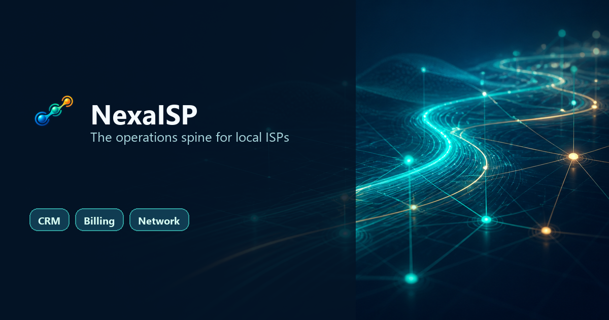
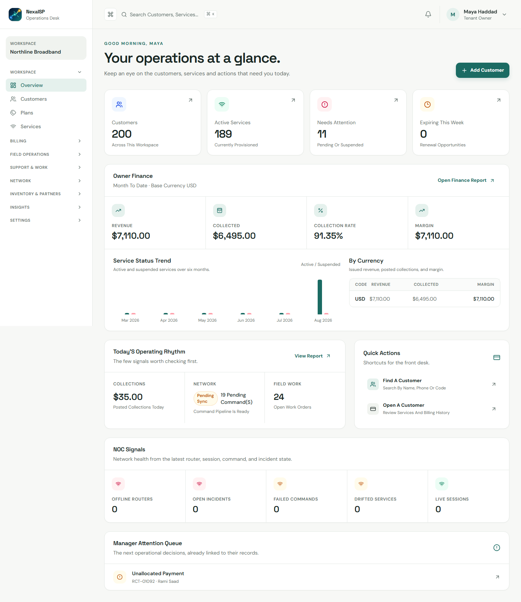
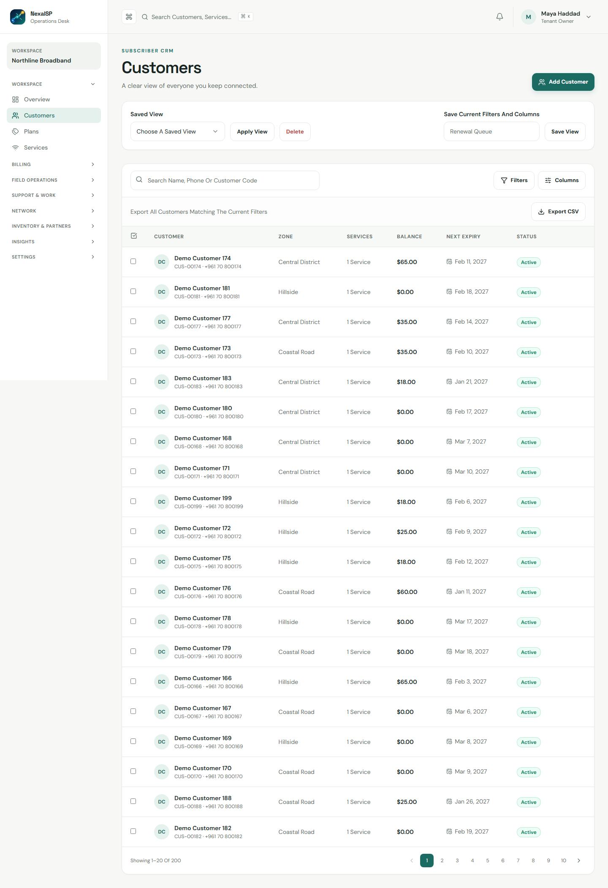
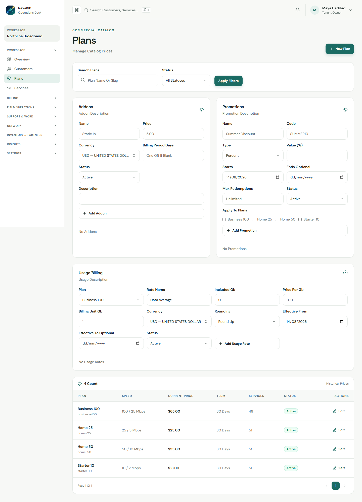
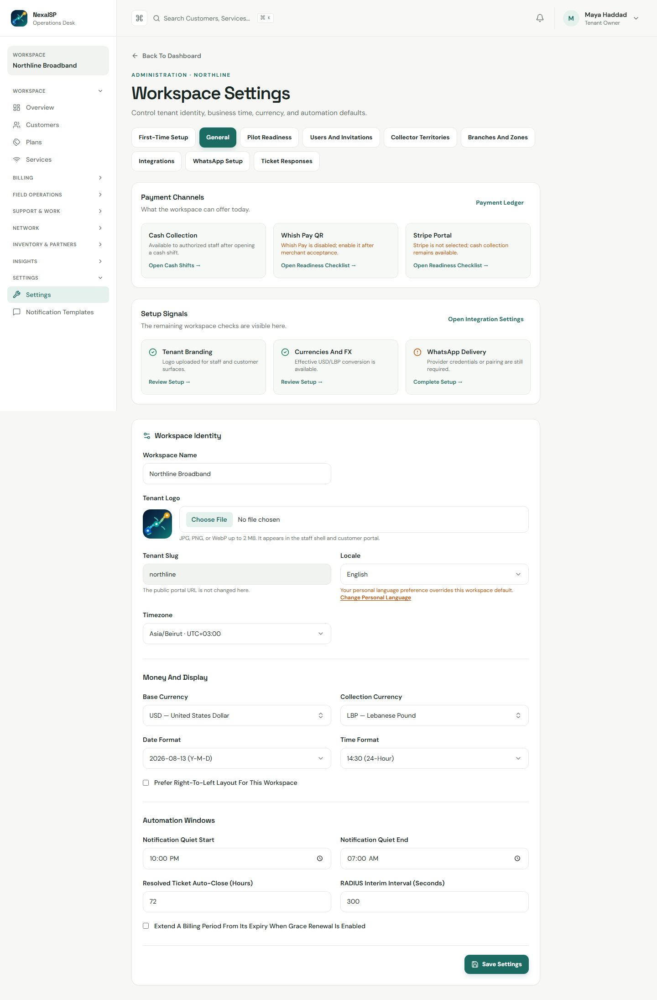
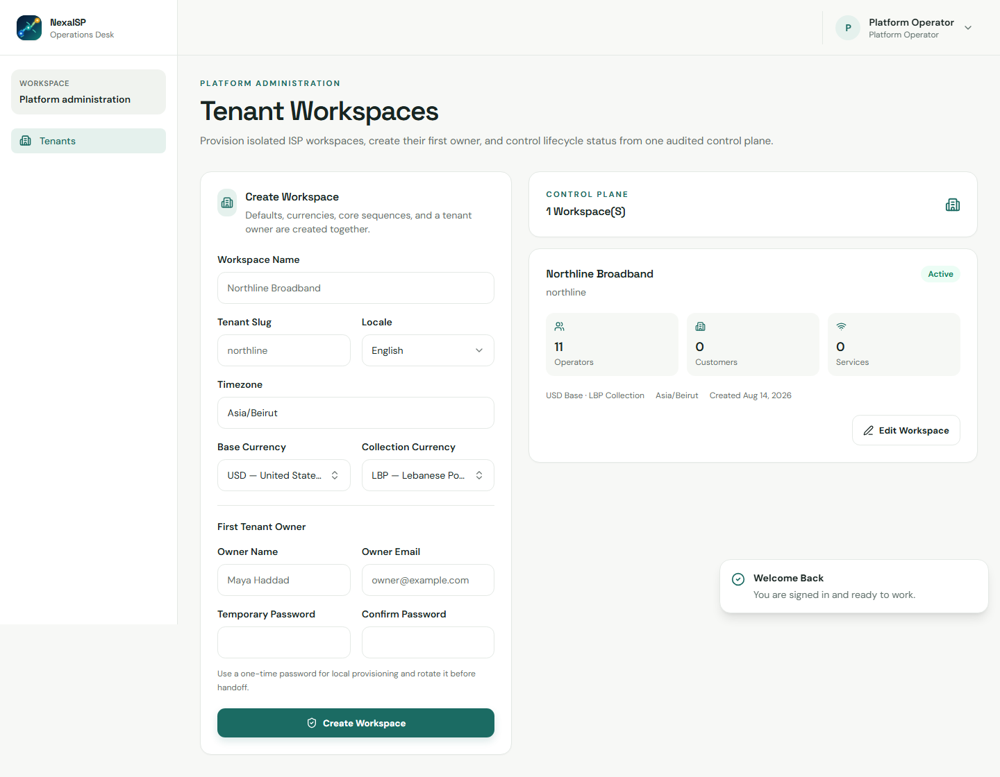

<p align="center">
  
</p>

<h1 align="center">NexaISP</h1>

<p align="center">
  The operations spine for local ISPs and internet resellers.
  <br />Know what is happening. Keep customers connected.
</p>

<p align="center">
  <a href="#what-nexaisp-does">Features</a> |
  <a href="#integrations">Integrations</a> |
  <a href="#screenshots">Screenshots</a> |
  <a href="#quick-start">Quick start</a>
</p>



NexaISP is a tenant-aware ISP operations platform that connects subscriber CRM, service provisioning, billing, collections, field work, support, inventory, and network operations in one focused workspace.

## What NexaISP does

| Area | What is included |
| --- | --- |
| **Platform control plane** | Shared-schema multi-tenancy, explicit `tenant_id` context, tenant provisioning, lifecycle status, audit events, and a `super_admin` control plane. |
| **Subscriber CRM** | Customer records, contacts, addresses, service locations, zones, documents, saved views, imports, search, and renewal queues. |
| **Service lifecycle** | Plans, effective-dated prices, add-ons, promotions, service activation, suspension, termination, provisioning modes, routers, IP pools, and scheduled plan changes. |
| **Billing and finance** | Invoices, credit notes, payments, ledger entries, payment allocations, FX conversion, cash shifts, collector custody, expenses, supplier payables, statements, and PDF/receipt links. |
| **Field operations** | Work orders, installation acceptance, field days, check-ins, routes, collector tasks, customer visits, GPS capture, expenses, stock requests, and mobile-friendly queues. |
| **Inventory and partners** | Serialized equipment, bulk stock, warehouses, technician vans, transfers, stock counts, recovery, supplier credentials, partner price books, reseller wallets, and settlements. |
| **Network operations** | Routers, RouterOS commands, RADIUS sessions and accounting, network state, reconciliation, optical devices/readings, topology buildings, POPs, splitters, and service drift signals. |
| **Support and messaging** | Ticket queues, canned ticket responses, notification templates, WhatsApp delivery accounts, delivery history, safety limits, test messages, and customer communication trails. |
| **Customer portal** | Tenant-branded portal, OTP sign-in, service status, invoices, payment links, secure card/QR payment flows, support tickets, profile details, and service notices. |
| **Governance and readiness** | Capability-based authorization, tenant roles, invitations, two-factor authentication, recent-authentication gates, audit trails, backup checks, provider probes, and pilot-readiness checklists. |

## Integrations

| Integration | Capability |
| --- | --- |
| **Stripe** | Card payments, payment intents, webhook verification, refunds/reversals, and ledger-safe settlement. |
| **Whish Pay** | QR checkout, provider status polling, verified callbacks, redirects, and payment reconciliation. |
| **Frankfurter** | Currency catalog refresh and effective-dated exchange-rate imports for multi-currency billing. |
| **WhatsApp Cloud API** | Tenant-configured templates, language variables, delivery receipts, test sends, and provider webhooks. |
| **WhatsApp Web.js** | Optional private bridge for dedicated operator accounts, QR pairing, controlled delivery, and account-level rate limits. |
| **MikroTik RouterOS** | Router health, subscriber reconciliation, provisioning commands, command queues, and network state checks. |
| **RADIUS / FreeRADIUS** | Interim accounting, active sessions, daily usage rollups, quota/FUP signals, and disconnect commands. |
| **Laravel Reverb + Echo** | Optional realtime updates for operational queues and network state. |
| **Redis, database queues, and S3-compatible storage** | Production-ready cache/queue options and private media, backup, receipt, and tenant-logo storage. |
| **Webhook adapters** | Optional SMS, FCM, external network, monitoring, and delivery integrations through signed webhooks. |

## Multi-tenancy and super admin

NexaISP keeps a single database with an explicit tenant context. Tenant-owned models are scoped automatically, while the platform control plane remains outside tenant context.

```text
super_admin / platform_operator
        |
        +-- Platform control plane
              +-- Tenant A -- tenant_owner -- staff roles
              +-- Tenant B -- tenant_owner -- staff roles
              +-- Tenant C -- tenant_owner -- staff roles
```

Create a tenant from **Platform administration -> Tenants** (`/admin/tenants`). The transaction creates the workspace, first owner, currencies, sequences, notification templates, operational defaults, and a platform audit event.

| Scope | Role | Purpose |
| --- | --- | --- |
| Platform | `super_admin` | Full platform authorization and tenant control-plane access. |
| Platform | `platform_operator` | Backward-compatible platform operator role. |
| Tenant | `tenant_owner` | Full access inside one tenant workspace. |
| Tenant | `operations_manager`, `billing_manager`, `cashier`, `collector`, `support_agent`, `technician`, `network_administrator`, `reseller_owner`, `reseller_staff`, `auditor` | Capability-limited staff roles. |

Authorization is capability-based (`$user->can('customers.view')`). The super admin is granted through Laravel's `Gate::before` hook and does not inherit tenant data by accident.

## Screenshots

The screenshots below are captured from the seeded local workspace and kept in [`docs/guides/screenshots`](docs/guides/screenshots).

### Sign in and command center

<p align="center">
  
  
</p>

### Subscriber CRM and commercial catalog

<p align="center">
  
  
</p>

### Tenant operations and platform control

<p align="center">
  
  
</p>

## Brand kit

The current NexaISP identity uses a connected signal path: three nodes represent customers, commercial operations, and network delivery.

| Asset | Use |
| --- | --- |
| [`public/brand/nexa-isp.svg`](public/brand/nexa-isp.svg) | Animated-capable app mark. The signal path flows continuously and respects `prefers-reduced-motion`. |
| [`public/brand/nexa-isp-mark.png`](public/brand/nexa-isp-mark.png) | Generated high-resolution source mark with alpha transparency. |
| [`public/brand/social/nexa-isp-linkedin-cover.png`](public/brand/social/nexa-isp-linkedin-cover.png) | 1500 x 500 LinkedIn/X cover banner. |
| [`public/brand/social/nexa-isp-open-graph.png`](public/brand/social/nexa-isp-open-graph.png) | 1200 x 630 website, GitHub, and Open Graph preview. |
| [`public/brand/social/nexa-isp-social-square.png`](public/brand/social/nexa-isp-social-square.png) | 1080 x 1080 social post tile. |
| [`public/brand/nexa-isp-social-wide.png`](public/brand/nexa-isp-social-wide.png) | Wide abstract network artwork for future campaign variants. |
| [`public/brand/nexa-isp-social-square.png`](public/brand/nexa-isp-social-square.png) | Square abstract service-network artwork for future campaign variants. |

Tenant logos can also be uploaded from **Settings -> Workspace settings**. JPG, PNG, and WebP files up to 2 MB are stored on the configured private disk and reused by the staff shell, customer portal, and payment receipts.

## Quick start

Requirements: PHP 8.3+, Composer 2, Node 22+, npm 10+, and SQLite for the fastest local loop. Docker is recommended for PostgreSQL, Redis, Mailpit, and MinIO.

```powershell
Copy-Item .env.example .env
composer install
php artisan key:generate
php artisan migrate --seed
npm ci
composer run dev
```

Open [http://localhost:8000](http://localhost:8000).

All seeded local accounts use the password `password`:

| Account | Role |
| --- | --- |
| `superadmin@example.com` | Super admin |
| `platform@example.com` | Platform operator |
| `admin@example.com` | Northline tenant owner |
| `operations.manager@example.com` | Operations manager |
| `billing.manager@example.com` | Billing manager |
| `cashier@example.com` | Cashier |
| `collector@example.com` | Collector |
| `support.agent@example.com` | Support agent |
| `technician@example.com` | Technician |
| `network.admin@example.com` | Network administrator |
| `reseller.owner@example.com` | Reseller owner |
| `reseller.staff@example.com` | Reseller staff |
| `auditor@example.com` | Auditor |

Never use seeded credentials outside local development.

### Optional WhatsApp bridge

```powershell
$env:PUPPETEER_EXECUTABLE_PATH = 'C:\Program Files\Google\Chrome\Application\chrome.exe'
npm run dev:whatsapp
```

Enable the private bridge values in `.env` first. The bridge is optional and should never be exposed directly to the public internet.

## Architecture

NexaISP is a modular Laravel monolith with an Inertia React front end:

- `app/Actions` owns one transactional operation per class.
- `app/Models` contains tenant-aware persistence and relationships.
- `app/Support/Tenancy.php` owns request and job tenant context.
- `resources/js/pages` contains Inertia React screens.
- `resources/js/lib/i18n.ts` contains the client translation dictionaries and safe key fallback.
- `database/migrations` contains explicit, indexed schema changes.
- `tests/Feature` and `tests/Unit` contain the Pest suite.

Money is stored as integer minor units with ISO currencies. Provider credentials and service secrets use encrypted casts, hidden serialization, authorization, recent authentication, and audit boundaries.

## Quality checks

```powershell
php artisan test --compact
vendor/bin/pint --dirty --format agent
vendor/bin/phpstan analyse --no-progress
npm run format:check
npm run typecheck
npm run build
```

For browser acceptance, install Chromium once with `npx playwright install chromium`, then run `npm run e2e`.

## Repository map

| Path | Purpose |
| --- | --- |
| `app/Actions` | Domain operations and workflows |
| `app/Models` | Tenant-aware Eloquent models |
| `app/Support` | Tenancy, provisioning, integrations, and readiness |
| `resources/js` | Inertia pages, components, layouts, and translations |
| `database/migrations` | Database schema |
| `tests` | Pest tests and browser acceptance |
| `docs` | Runbooks, screenshots, and architecture notes |
| `public/brand` | NexaISP logo and social brand assets |

## Deployment

Use the production procedure in [`docs/runbooks/deployment.md`](docs/runbooks/deployment.md). Set a public `APP_URL`, keep PostgreSQL/Redis/object storage private, enable production two-factor enforcement, configure signed provider webhooks, and run the platform preflight before accepting tenant traffic.
