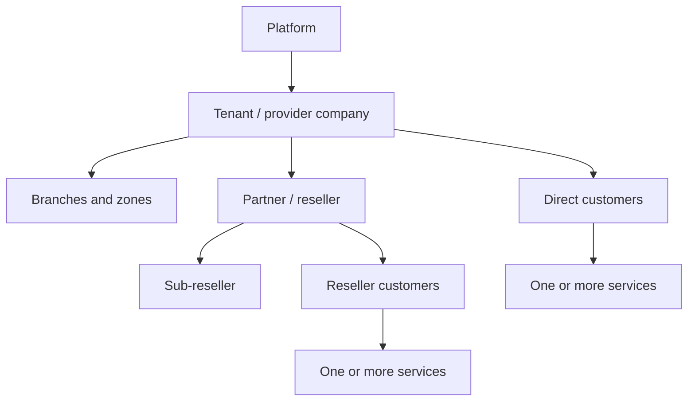
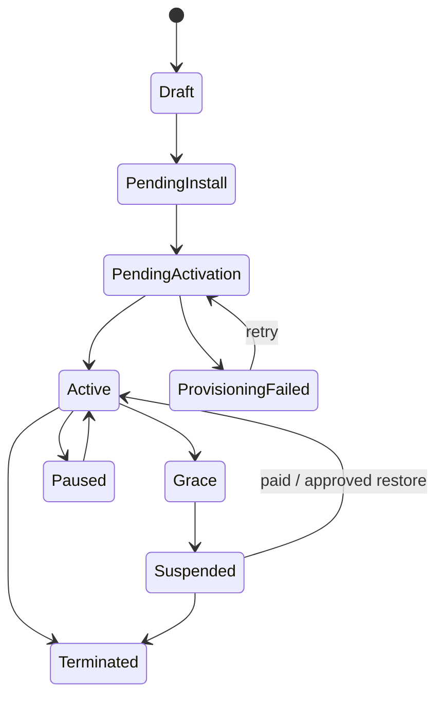
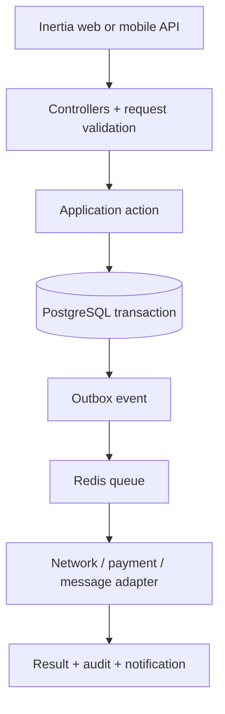
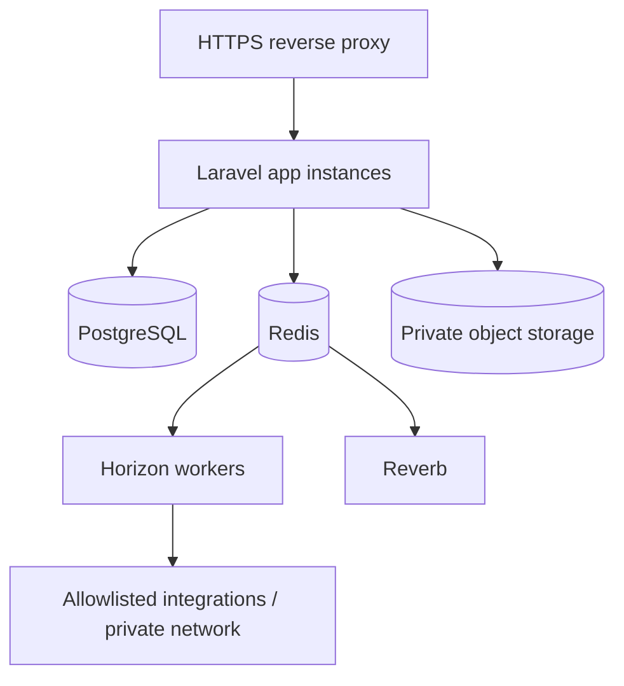

# ISP Reseller Operations Platform

## Research-backed product, architecture, and AI build handoff

**Prepared:** 10 August 2026  
**Target stack:** Laravel 13, React 19, Inertia 3, TypeScript, Tailwind 4, PostgreSQL, Redis  
**Audience:** product owner, lead developer, and implementation AI agent  
**Working name:** `NetResell` (placeholder only; choose branding before public launch)

---

## 1. Executive recommendation

Build a multi-tenant-ready, API-first **modular monolith** for neighborhood ISPs/WISPs and internet resellers. The product must join four areas that are often split across spreadsheets and router dashboards:

1. Subscriber CRM and service lifecycle.
2. Prepaid/postpaid billing, cash collection, reseller wallets, and profit tracking.
3. Network provisioning and accounting through replaceable adapters.
4. Support, field work, CPE inventory, outages, and communication.

Do **not** begin as microservices, do **not** make router state the financial source of truth, and do **not** couple the product to MikroTik. Start with a modular Laravel application, a versioned JSON API, reliable background jobs, an immutable financial ledger, and a network adapter layer.

The recommended first production release serves one provider/reseller company but keeps a `tenant_id` boundary on every owned record. It supports multiple upstream suppliers, multiple branches/zones, staff, collectors, customer services, packages, renewals, invoices, payments, equipment assignments, tickets, and manual or adapter-based provisioning. Full RADIUS accounting, sub-reseller wallets, mobile apps, and advanced monitoring are delivered in later phases.

### The most important domain decisions

- A **customer** is a person or business; a **service** is one internet connection. One customer may have several services.
- A **plan** is a reusable commercial definition; a **subscription** stores a versioned price and terms snapshot.
- An **invoice** is what is owed; a **payment** is money received; a **renewal** changes service entitlement. These are related but never represented by one row.
- Wallet and money operations use immutable ledger entries, integer minor units, database transactions, and row locks.
- Provisioning uses an idempotent command/outbox workflow. Billing success does not depend on a router responding in the same HTTP request.
- Network integrations are adapters. A service can run in `manual`, `upstream_credential`, `mikrotik`, `radius`, or future `uisp` mode.
- For a cloud deployment, router-management ports must not be exposed publicly. Use a VPN or a later outbound-only site connector.

---

## 2. Assumptions and decisions to confirm before coding

The plan uses the recommended defaults below. The implementation agent must create `docs/product-decisions.md`, record the answers, and stop before Phase 1 if any answer changes the data model materially.

| Decision | Recommended default | Why it matters |
|---|---|---|
| Primary market | Lebanon-first, country-configurable | Enables Arabic/English, USD/LBP, cash collection, while avoiding hard-coded local rules. |
| Product owner model | One SaaS installation may host unrelated providers | Requires true tenant isolation. A single-company deployment is one tenant. |
| Reseller hierarchy | Tenant → partner/reseller → optional sub-reseller | Separates SaaS tenancy from commercial reseller hierarchy. |
| Billing modes | Prepaid and postpaid | Local resellers commonly use renewals, but business customers may need invoices. |
| Payment methods | Cash first; bank transfer/manual wallet; gateways later | Keeps MVP usable without dependence on one payment provider. |
| Currencies | USD and LBP enabled; more configurable | Every transaction has one currency and a snapshotted exchange rate when converted. |
| Tax | Configurable, off by default | Tax/legal treatment must be confirmed by the operator's accountant. |
| Network ownership | Some resellers control routers; others receive upstream credentials | Requires several provisioning modes. |
| Initial network integration | Manual + upstream credential inventory; MikroTik adapter next | Gives a safe MVP before automating router changes. |
| Central AAA | FreeRADIUS integration in a later phase | Better for multiple NAS routers; not required for CRM/billing MVP. |
| Customer portal | Responsive web portal after staff MVP | Uses the same backend and API; native mobile can follow. |
| Staff mobile use | Collector/technician API is higher priority than customer native app | Provides immediate operational value. |
| Hosting | Linux VPS with managed PostgreSQL/Redis when possible | Straightforward Laravel operations; on-prem remains supported. |
| Data retention | Financial/audit records retained; operational retention configurable | Avoids deleting evidence required for reconciliation. |
| Offline mobile | Later phase with explicit sync design | Offline financial writes need conflict and idempotency rules. |

### Discovery questions for the product owner

1. Do resellers purchase individual upstream accounts/cards, bulk bandwidth, or both?
2. What fields arrive from an upstream supplier: username, password, quota, profile, expiry, serial, PIN, or voucher code?
3. Is renewal aligned to a fixed calendar day or a rolling duration from payment/reactivation?
4. Does late renewal backdate to the previous expiry or start from the payment date?
5. Is there a grace period, reduced-speed state, full suspension, or manual-only suspension?
6. Can a customer pause service? Are pause days preserved?
7. Are unused days or quota carried over?
8. Are collectors allowed to discount, waive debt, backdate payments, or reactivate service?
9. Who holds cash, and what is the cash handover/approval process?
10. Do resellers have prepaid wallets, credit limits, postpaid settlement, commission, or a mixture?
11. Can a child reseller see the upstream wholesale cost or only its own price?
12. Which currencies are collected and in which currency are plans priced?
13. Is a customer receipt legally required to have a sequential number per branch/device?
14. What routers/NAS/CPE brands and versions are deployed?
15. Is PPPoE, Hotspot, DHCP/IPoE, static IP/MAC, or a mixture used?
16. Is a central RADIUS server already present?
17. Does the operator control DNS/walled-garden redirection for suspended users?
18. What notifications are required: WhatsApp, SMS, email, push, printable slips?
19. What reports are currently created in Excel, and who signs off each report?
20. How many tenants, customers, active services, NAS devices, concurrent sessions, invoices/month, and staff are expected in years 1 and 3?

---

## 3. Research synthesis and product positioning

Current ISP platforms converge on the same core capability groups. Splynx combines recurring/prepaid billing, CRM, RADIUS, IPAM, monitoring, ticketing, field service, inventory, communications, customer portals, and an open API. Sonar similarly presents billing, CRM, monitoring, field service, and inventory as one OSS/BSS. UISP distinguishes physical network topology and devices from CRM customers and services, and supports suspension/traffic shaping when compatible gateways are present. These are strong signals that the domain cannot be modeled as only `customers + payments`.

Reseller-specific products add a second layer: reseller/sub-reseller hierarchy, selective plan availability, per-reseller price books and margins, prepaid/postpaid settlement, wallets or credit limits, and constrained staff access. The proposed product includes these concepts but deliberately stages them after a reliable direct-provider MVP.

### Differentiation opportunity

For small local providers, the product should compete on operational clarity rather than carrier-scale complexity:

- Arabic/English RTL/LTR from the beginning.
- Fast renewal and cash collection flows.
- USD/LBP and exchange-rate snapshots.
- Upstream credential inventory for resellers who do not control a router.
- Simple manual mode that remains useful before network automation.
- A migration path from spreadsheet → billing → MikroTik/RADIUS without changing the customer model.
- Clear profit and outstanding-cash reporting by supplier, reseller, zone, collector, and plan.
- Responsive screens usable at a shop counter or from a technician's phone.

### Product boundaries

This is an operational billing and service platform, not:

- a full general ledger/accounting replacement;
- an ACS implementation for TR-069/TR-369;
- a network monitoring system intended to replace a mature NMS;
- a router configuration editor that permits arbitrary commands;
- a tax/legal compliance guarantee;
- a native mobile app in the initial delivery.

It may integrate with accounting, ACS, NMS, mapping, messaging, and payment systems later.

---

## 4. Goals, success metrics, and non-functional targets

### Product goals

1. A staff member can find a subscriber, see money/service/network/support context, accept payment, issue a receipt, and initiate renewal from one screen.
2. A manager can reconcile expected payments, actual collections, reseller balances, supplier costs, and cash handovers without spreadsheets.
3. Service activation, change, suspension, and restoration are traceable, retryable, and safe if a network device is unavailable.
4. Each tenant, branch, reseller, and role sees only authorized data and actions.
5. Every mobile-worthy capability is available through a stable `/api/v1` contract.

### Operational success metrics

- At least 95% of ordinary renewals completed in under 45 seconds of staff interaction.
- Zero unexplained wallet balance mutations; every balance change traces to a journal entry and actor.
- 100% of service lifecycle changes have an audit event and provisioning result.
- Failed provisioning is visible and retryable; it never silently marks a service as active.
- Month-end payment totals reconcile by currency, branch, method, and collector.
- No tenant-boundary failure in automated authorization tests.
- Core dashboard p95 under 1.5 seconds for the expected production dataset after warm cache.
- API error rate and queue failure rate are observable.

### Initial scale target

Design and test for:

- 50 tenants;
- 100,000 customers and 150,000 services total;
- 10,000 concurrent network sessions in the accounting store;
- 1 million invoices/year;
- 5 million audit/accounting events/year;
- 200 concurrent staff sessions.

These are engineering targets, not promised limits. Validate them with representative load tests before launch.

---

## 5. Personas and permission model

| Persona | Main responsibilities | Restricted from |
|---|---|---|
| Platform operator | SaaS tenant lifecycle and platform health | Tenant financial/customer data by default; access must be break-glass and audited. |
| Tenant owner | Company settings, roles, finance, integrations | Nothing inside its tenant except platform secrets. |
| Operations manager | Customers, services, staff, approvals, reports | Platform/other-tenant data. |
| Billing manager | Plans, invoices, adjustments, settlements | Router credentials and high-risk network operations unless separately granted. |
| Cashier | Receive payments, print receipts, close own till | Voids/refunds/discounts above policy limit. |
| Collector | Assigned customers, receive field cash, sync receipts | Other routes, price changes, debt write-offs. |
| Support agent | Customer/service view, tickets, diagnostics | Wholesale cost, wallet operations, secret credentials. |
| Technician | Assigned work orders, equipment, installation evidence | Billing edits and broad customer exports. |
| Network administrator | NAS, pools, provisioning, sessions, diagnostics | Financial adjustments unless separately granted. |
| Reseller owner | Own descendants, price book, customers, wallet, statements | Parent cost/margin, siblings, tenant-wide settings. |
| Reseller staff | Delegated subset of reseller functions | Wallet funding, price/margin management by default. |
| Auditor/read-only | Reports, audit, non-secret records | Mutations and decrypted secrets. |
| Customer | Own accounts, services, invoices, payments, tickets | Staff-only notes, costs, other customers. |

Use capabilities, not role-name checks. Seed roles are templates; policies authorize actions using tenant membership, partner scope, ownership, branch/zone scope, status, approval limit, and permission.

Example permissions:

```text
customers.view, customers.create, customers.update, customers.export
services.view, services.create, services.activate, services.suspend, services.change_plan
billing.invoices.view, billing.invoices.issue, billing.adjustments.create
payments.collect, payments.backdate, payments.void, refunds.approve
wallets.view, wallets.fund, wallets.adjust, settlements.approve
network.view, network.provision, network.disconnect, network.credentials.reveal
inventory.view, inventory.receive, inventory.transfer, inventory.assign, inventory.write_off
tickets.view, tickets.create, tickets.assign, tickets.close
reports.finance, reports.operations, reports.export
settings.manage, users.manage, roles.manage, audit.view
```

---

## 6. Domain model and terminology

### Ownership hierarchy



- **Tenant:** one legally/operationally independent provider company.
- **Partner:** a reseller or sales/operations partner within a tenant. Partners form an adjacency-list hierarchy with a cached path/depth.
- **Branch:** financial/operational office or shop.
- **Zone:** geographic/service area; can contain sites, towers, buildings, or streets.
- **Customer account:** person or business responsible for services and balances.
- **Service:** one sellable connection at one location.
- **Subscription:** plan entitlement and commercial terms for a service over time.
- **Plan/product:** reusable offer; immutable versions preserve history.
- **Supplier:** upstream internet provider or equipment/vendor company.
- **Provisioning target:** external identity on a router/RADIUS/upstream account.

### Service modes

| Mode | Meaning | MVP behavior |
|---|---|---|
| `manual` | Staff tracks service; network handled outside app | Create queued checklist/action and allow authorized manual confirmation. |
| `upstream_credential` | A purchased account/voucher is assigned to the customer | Reserve and assign credential inventory; warn before expiry/quota exhaustion. |
| `mikrotik` | App provisions a RouterOS PPP/Hotspot/etc. identity | Adapter creates/updates/disables; command results are recorded. |
| `radius` | Central AAA authorizes and accounts sessions | App manages authorization data; RADIUS sends accounting updates. |
| `external` | Third-party OSS/UISP/ACS is system of execution | Webhook/API adapter; local service remains commercial source of truth. |

### Core state machines

#### Service



The commercial state and provisioning state are separate fields. A paid subscription may be `commercial_status=active` while `provisioning_status=failed`; the UI must display both.

#### Invoice

`draft → issued → partially_paid → paid` with terminal alternatives `void` and `written_off`. An issued invoice is not edited; corrections use credit/debit notes or a controlled void-and-reissue flow.

#### Payment

`pending → confirmed → allocated`, with terminal alternatives `failed`, `voided`, and `refunded/partially_refunded`. Cash can be confirmed immediately; gateway/bank payments may require asynchronous confirmation.

#### Provisioning command

`pending → claimed → executing → succeeded`, or `retry_wait → executing`, or terminal `failed/cancelled`. Commands have an idempotency key and desired-state version.

---

## 7. Functional requirements by module

### 7.1 Platform, tenancy, localization, and settings

**P0**

- Create/suspend tenants and tenant owners.
- Tenant profile, logo, address, timezone, default language, default/base currency, enabled currencies, receipt/invoice prefixes.
- Tenant membership with branch, zone, and partner scopes.
- Arabic and English UI with RTL/LTR switching; store canonical UTC timestamps and render in tenant/user timezone.
- Configurable number/date/money formatting.
- Role and permission management with safe templates.
- Feature flags per tenant for modules not yet enabled.
- Per-tenant sequential numbers for customers, services, invoices, receipts, tickets, and work orders using locked sequence rows.
- Tenant-scoped custom fields for customers/services with typed definitions; do not use unrestricted JSON for core searchable fields.

**P1**

- Tenant subscription/plan for SaaS commercial billing.
- Custom domain, branded customer portal, configurable document templates.
- Approval rules by amount/action.

### 7.2 Subscriber CRM

**P0**

- Person and business customer accounts.
- Customer number, legal/display name, primary phone, secondary phone, email, ID/reference number, notes, tags, language preference.
- Multiple contacts and multiple service/billing addresses.
- Geolocation with manual coordinates and map link; no map vendor lock-in.
- Status: lead, active, delinquent, suspended, archived; status is derived or governed, not freely typed.
- Duplicate detection using normalized phone, email, identity reference, and fuzzy name warning.
- Timeline aggregating service, invoice, payment, ticket, work order, equipment, note, and notification events.
- Attachments with category, visibility, uploader, checksum, and malware-scan status.
- Import from CSV with preview, column mapping, validation report, dry run, and reversible batch identifier.
- Export only with explicit permission and audit event.

**P1**

- Lead/source pipeline and installation quote.
- Household/organization relationships and authorized contacts.
- Consent/preferences for communication channels.

### 7.3 Product catalog, plans, and price books

**P0**

- Product type: internet, installation, equipment rental/sale, static IP, support, discount, fee.
- Internet plan fields: display name, technology, billing mode, duration, download/upload speed, quota, FUP profile, concurrent session limit, grace rules, tax category.
- Plan versions. Published versions are immutable; new terms create a new version.
- Retail price and internal estimated cost per currency.
- One-time, recurring, deposit, discount, and usage line types.
- Partner price books: plan availability, reseller buy price, suggested retail, minimum/maximum retail, commission/margin rule, effective dates.
- Plan changes scheduled now or at next cycle, with configurable proration.

**P1**

- Bundles, add-ons, top-ups, seasonal offers, coupons.
- Contract term and early termination charge rules.

### 7.4 Services, subscriptions, renewals, and lifecycle

**P0**

- Multiple services per customer, each with service location, zone, branch, partner, plan, billing cycle, install date, activation/expiry dates, and provisioning mode.
- Subscription history with price/terms snapshots.
- Prepaid renewal preview before commit: period, price, discount, credit, tax, customer payment, reseller cost, new expiry, and provisioning action.
- Configurable renewal policy:
  - extend from current expiry if not expired;
  - start from payment time/date if expired;
  - optionally backdate within grace;
  - optional fixed calendar billing anchor.
- Suspension/grace/reactivation rules executed by scheduled jobs.
- Pause/resume with reason, approval, and optional expiry extension.
- Plan upgrade/downgrade preview and effective-date choice.
- Termination preserves history and releases/returns resources through workflow.
- Bulk renewal/suspension operations require preview and explicit confirmation.

**P1**

- Customer self-reactivation.
- Quota top-ups and usage threshold notifications.
- Multi-service consolidated billing.

### 7.5 Billing, payments, and immutable finance records

**P0**

- Recurring and one-off invoices with immutable issued snapshots.
- Invoice lines, tax/discount breakdown, due date, customer and seller snapshot.
- Payments in one currency with method, external reference, received time, branch, cashier/collector, evidence attachment, and idempotency key.
- Payment allocation across one or more invoices; unapplied customer credit is supported.
- Partial payments, overpayments, credit notes, debit adjustments, controlled write-offs.
- Refund record separate from payment void. A refund in the app must state whether money was actually returned outside the system.
- Sequential printable/PDF receipt.
- Cash drawer/session: opening float, collections, paid-outs, expected closing, counted closing, discrepancy, handover, approver.
- Daily close per branch/cashier/currency/method.
- Every financial mutation posts a balanced journal entry. Issued documents and posted entries are never hard-deleted.
- Store money as integer minor units plus ISO currency. Never use binary float.
- Store exchange rate as decimal and snapshot the rate/source/date on conversions.

**P1**

- Bank statement import and assisted reconciliation.
- Payment gateway abstraction and signed/idempotent webhooks.
- Dunning sequences and promise-to-pay.
- Accounting export adapters.

### 7.6 Reseller, supplier, wallet, and settlement operations

**P0 supplier features**

- Suppliers and upstream contracts.
- Supplier packages/accounts, wholesale cost, valid period, quota, and status.
- Purchase batches for imported upstream credentials/vouchers.
- Credential states: imported, available, reserved, assigned, active, expired, revoked, invalid.
- Assignment history; credentials are encrypted and reveal is permissioned/audited.
- Supplier invoice/payment reference and cost allocation to service/period.
- Supplier reconciliation: purchased, assigned, unused, expiring, and cost by period.

**P1 reseller features**

- Partner hierarchy with maximum depth configured by tenant.
- Prepaid wallet, postpaid settlement, or hybrid per partner.
- Credit limit and low-balance threshold.
- Price book and plan entitlement per partner.
- Immutable wallet ledger and statements.
- Parent funding, bank/cash top-up request, approval, reversal, and settlement.
- Renewal checks available funds/credit atomically, debits buy price, credits appropriate revenue/margin accounts, and records a complete commercial breakdown.
- Commissions calculated from versioned rules; no recalculation of posted history when a rule changes.
- Partner dashboard and scoped staff.

**P2**

- Cascading multi-level margin settlement.
- Automated settlement invoices and payout workflows.

### 7.7 Collection routes and field cash

**P0**

- Assign customers/services to collector and optional route/day.
- Collector view: due/expiring accounts, contact shortcut, location, amount, last payment, notes.
- Record collection with server-issued idempotency key and receipt number.
- Collector cannot silently change plan, discount, backdate, or write off debt.
- Cash batch/handover to cashier, counted totals, discrepancy reason, receiver approval.
- Reassign route with audit history.

**P1 offline preparation**

- Download a bounded assignment package; server is authoritative.
- Client-generated UUID for each offline operation.
- Conflict rules: duplicate UUID returns original result; changed amount/plan requires online re-preview; no offline wallet adjustment or refund.
- Local encrypted storage and explicit device revocation.

### 7.8 Network inventory, IPAM, and provisioning

**P0**

- Network sites, towers/buildings, nodes, NAS/router records, vendor/model/version, management address, status, zone.
- Secrets stored in encrypted columns or an external secret store; list APIs never return them.
- Management endpoint validation blocks loopback, link-local, metadata endpoints, and unapproved private ranges unless the tenant explicitly allowlists them.
- IP pools/prefixes, IPv4/IPv6 address assignments, MAC addresses, VLAN/service identifiers.
- Provisioning profile maps commercial plan version to adapter-specific attributes.
- Desired state per service and current observed state.
- Provisioning commands with retries, timeout, adapter response redaction, actor, correlation ID, and manual retry/cancel.
- Manual provisioning checklist and confirmation for operators without integration.
- Network actions are allowlisted domain operations: activate, suspend, change profile, disconnect session, rotate credential, fetch status. No arbitrary CLI field in ordinary UI/API.

**P1 MikroTik adapter**

- HTTPS RouterOS REST/API connection with certificate verification.
- Dedicated least-privilege RouterOS account; never use the default admin account.
- Create/update/enable/disable PPP secret or supported service identity.
- Map speed/profile, address pool/static IP, simultaneous session settings.
- Fetch active sessions and disconnect a selected session.
- Connection test that reports capability/version without exposing secrets.
- Idempotent lookup by an app-owned immutable reference/comment, not display name alone.

**P1 RADIUS adapter/accounting**

- Central RADIUS authorization records for PPPoE/Hotspot/IPoE as selected.
- NAS client management and rotated shared secrets.
- Start, interim-update, and stop accounting ingestion.
- Session uniqueness, duplicate packet tolerance, usage counters, last-seen and stale-session cleanup.
- CoA/disconnect support only after vendor compatibility testing.
- Accounting data is operational; invoices are not recomputed from mutable raw sessions unless a versioned usage-rating module is explicitly enabled.

**P2**

- SNMP/ping telemetry integration with an existing monitoring system.
- UISP integration.
- ACS integration for TR-069 and later USP/TR-369; do not implement ACS inside the Laravel app.
- Topology maps, capacity, outage correlation, automated backup/change control.

### 7.9 CPE and stock inventory

**P0**

- Warehouses/locations, product models, serialized and bulk stock items.
- Supplier, purchase cost/currency, serial, MAC, asset tag, warranty, condition.
- Immutable stock movements: receive, transfer, reserve, assign, install, recover, repair, return, write-off, adjust.
- Assign CPE/cable/accessories to service/work order/customer; keep full custody history.
- Deposit, rental, sale, or company-owned treatment.
- Prevent the same serialized item from being active on two services.
- Low-stock and warranty-expiry alerts.

**P1**

- Purchase orders, goods receipt, barcode/QR scanning, repair workflow.

### 7.10 Support, incidents, and field service

**P0**

- Ticket types: connectivity, speed, billing, installation, relocation, equipment, other.
- Priority, status, source, assignee/team, related customer/service/device/outage.
- Public replies versus internal notes, attachments, tags, timeline.
- SLA response/resolution targets configurable by priority/plan.
- Work orders with type, schedule, assignee, checklist, equipment reservations, customer confirmation, before/after notes and photos.
- Convert ticket to work order without duplicating context.
- Outage incident with affected zones/sites/nodes/services, start/end, severity, update history, root cause, resolution.
- Bulk notify affected customers and suppress duplicate individual tickets when appropriate.

**P1**

- Skill/territory assignment, route calendar, customer signature, technician mobile workflow.
- Automated ticket creation from monitoring events.

### 7.11 Communication and notifications

- Unified notification template keyed by event and language.
- Channels are adapters: in-app, email, SMS, WhatsApp, push.
- Events: welcome, upcoming expiry/due, payment receipt, activation, suspension, restoration, ticket/work-order update, outage notice, wallet low balance.
- Quiet hours, customer preferences/consent, retry, provider delivery ID, status, failure reason.
- Templates use approved variables and preview; never permit arbitrary executable expressions.
- Bulk sends require recipient count preview, permission, rate limit, and audit.

### 7.12 Customer portal

**P1 responsive web portal**

- Customer authentication by verified contact with optional one-time code/password policy.
- Account/service status, current plan, expiry/due date, invoices, receipts, payment history.
- Download documents, submit/view tickets, outage banner, update allowed profile fields.
- Renewal/payment intent when a payment provider or cashier approval flow exists.
- Device/session list and token revocation.

Never show router/RADIUS/upstream passwords unless the business explicitly requires customer access and the secret is safe to disclose.

### 7.13 Dashboards and reports

**P0 dashboards**

- Active, grace, suspended, expiring, and provisioning-failed services.
- Collections today by currency/method/branch/collector.
- Outstanding invoices and aging.
- New/churned services.
- Failed jobs/integrations requiring action.
- Open tickets, overdue SLA, work orders today.

**P0 reports**

- Subscriber/service list and lifecycle changes.
- Expiry/renewal cohort and churn.
- Revenue, discounts, refunds, write-offs, taxes by period and currency.
- Cashier/collector session and handover reconciliation.
- Receivables aging.
- Plan and zone performance.
- Supplier credential utilization and cost.
- Gross margin estimate by plan/zone/partner/supplier.
- Stock on hand, movement, assignments, and valuation.
- Audit and privileged-action report.

All large exports run as queued jobs, enforce authorization when requested and when downloaded, expire signed links, and record who exported what.

---

## 8. UX and information architecture

### Staff navigation

```text
Dashboard
Customers
Services
Renewals
Billing
  Invoices
  Payments
  Cash sessions
  Credits / refunds
Partners / Resellers
Suppliers
Network
  Sites & nodes
  NAS / routers
  IP pools & addresses
  Sessions
  Provisioning queue
Inventory
Support
  Tickets
  Work orders
  Outages
Reports
Settings
```

### High-value screens

1. **Global search/command palette:** customer number, name, normalized phone, service username, IP, MAC, serial, invoice, receipt, ticket.
2. **Customer 360:** summary header plus services, billing, payments, equipment, tickets, timeline, documents.
3. **Renewal desk:** scan/search → select service → preview totals/new expiry → payment → receipt → provisioning result.
4. **Provisioning operations:** desired/current state, pending/failed actions, sanitized error, retry, related service.
5. **Cash close:** expected by denomination/currency/method, counted, discrepancy, handover approval.
6. **Manager attention queue:** expired active services, paid but provisioning failed, unallocated payments, stale sessions, low reseller balances, expiring supplier credentials.

### UI rules

- Desktop-first responsive interface; renewal, collector, work order, and customer pages must work at 360 px width.
- Never encode state by color alone. Show state label, icon, and time.
- Destructive/financial actions show impact preview and require a reason; high-risk actions may require re-authentication and approval.
- Use server-driven filters, sorting, pagination, and URL state for large lists.
- Use Inertia partial/deferred props for expensive dashboard sections.
- Display money with currency beside every amount; do not merge currencies into one total without a named conversion rate/date.
- Provide empty, loading, error, partial-failure, and retry states.
- Arabic labels and tables must be visually tested in RTL; technical identifiers such as IP/MAC/usernames remain LTR.

---

## 9. Technical architecture

### 9.1 Recommended stack

| Layer | Choice |
|---|---|
| Backend | Laravel 13 on PHP 8.3+ |
| Web UI | Official Laravel React starter kit: React 19, Inertia 3, TypeScript, Tailwind 4, shadcn/ui |
| API | Versioned REST/JSON `/api/v1`, Laravel API Resources, OpenAPI 3.1.1 contract |
| Authentication | Cookie/session + CSRF for staff/customer web; Sanctum bearer tokens and abilities for mobile/API devices |
| Authorization | Laravel policies/gates plus a permission package or small internal capability layer; always include ownership/scope checks |
| Database | PostgreSQL 17+ preferred |
| Cache/queue/locks | Redis |
| Queue dashboard | Horizon |
| Realtime | Laravel Reverb/Echo for in-app events; polling fallback where useful |
| Object storage | S3-compatible private storage; local private disk allowed for single-server development |
| Search | PostgreSQL indexed search first; external search only after measured need |
| Testing | Pest or PHPUnit, React Testing Library/Vitest, Playwright for critical flows |
| Quality | Pint, PHPStan/Larastan, ESLint, TypeScript strict mode, Prettier |
| Observability | Structured logs, correlation IDs, metrics, exception tracking, Pulse/Horizon dashboards |

Laravel 13 currently requires PHP 8.3 and has security support through March 2028. The official React starter kit already uses Inertia 3, React 19, Tailwind 4, and shadcn/ui, so use it instead of hand-assembling a stale frontend stack.

### 9.2 Modular monolith boundaries

```text
app/Domain/
  Identity/
  Tenancy/
  CRM/
  Catalog/
  Subscription/
  Billing/
  Partners/
  Suppliers/
  Network/
  Inventory/
  Support/
  FieldService/
  Communications/
  Reporting/
  Audit/
```

Each module may contain `Actions`, `Data`, `Enums`, `Events`, `Exceptions`, `Jobs`, `Models`, `Policies`, `Queries`, `Rules`, and `Services`. HTTP controllers remain thin and call application actions. Do not make a generic repository layer around Eloquent. Use explicit query objects for complex list/report queries and action classes for business transactions.

Module rules:

- Cross-module changes happen through application actions and domain events, not model observers with hidden behavior.
- Models do not call external routers, gateways, or messaging APIs.
- Financial posting and provisioning orchestration are explicit services with integration tests.
- No module reads another module's private tables through ad-hoc raw SQL. Define a public query/service contract.
- Avoid premature interfaces for every class; interfaces are required at external adapter boundaries.

### 9.3 Request and async flow



Example renewal:

1. Client requests a renewal preview.
2. Server computes a signed short-lived quote/preview from current service, plan, price book, wallet, tax, and dates.
3. Confirm request supplies preview ID and idempotency key.
4. In one database transaction: lock service/wallet/sequence rows, verify preview, create/issue invoice as configured, record/allocate payment, post journal, create subscription period, update commercial desired state, and write an outbox event.
5. Commit before any network call.
6. Queue worker creates an idempotent provisioning command and invokes the configured adapter.
7. UI receives progress/result over broadcast or polling.
8. Failed provisioning appears in the attention queue without losing the posted payment.

### 9.4 Multi-tenancy

Use shared-schema tenancy with a required `tenant_id` on every tenant-owned table. Do not rely only on a global Eloquent scope.

Enforcement layers:

1. Resolve tenant from authenticated membership/host, never from an untrusted body field.
2. Apply an explicit tenant context in repositories/query objects.
3. Laravel policies verify tenant, partner-tree scope, branch/zone scope, role capability, and record state.
4. Composite unique constraints include `tenant_id`.
5. Foreign keys should include tenant-safe invariants where practical; use tests/triggers for boundaries not expressible simply.
6. Queue jobs serialize `tenant_id`, actor/correlation context, and re-establish tenant context before querying.
7. API resources never serialize secret/wholesale/audit fields merely because they are loaded.
8. Automated tests attempt cross-tenant access for every API resource and nested route.

Do not add PostgreSQL RLS in the first implementation unless the team is ready to manage connection context correctly across queues, CLI commands, migrations, and tests. It can be a defense-in-depth upgrade after application isolation is proven.

### 9.5 Network connectivity architecture

Deployment modes:

- **On-network deployment:** Laravel workers can connect to allowlisted routers over a management VLAN. Simpler for one provider.
- **Cloud over private VPN:** preferred when manageable; app reaches routers only through a private network.
- **Outbound connector:** later agent installed at each site polls/streams signed commands outward over mTLS, runs only allowlisted adapter operations, and returns signed results. This is the safest scalable cloud pattern for routers behind NAT.

Never expose RouterOS REST/API/SSH directly to the public internet just to make the app work. RouterOS REST uses HTTP Basic credentials, so enforce HTTPS with certificate verification and least-privilege users.

### 9.6 Reliability patterns

- Database outbox for external side effects.
- Idempotency keys on renewal, payment, wallet, provisioning, imports, and webhooks.
- `DB::transaction()` plus `lockForUpdate()` for wallet balances, stock reservations, document sequences, and conflicting service transitions.
- Unique constraints enforce idempotency at the database, not cache alone.
- Exponential retry with jitter and a terminal dead-letter/failed state.
- `withoutOverlapping()` and `onOneServer()` for expiry, invoice, dunning, import, and reconciliation schedules.
- External calls have connection/read timeouts, bounded retries, circuit-breaker state, sanitized logs, and rate limits.
- Desired-state version prevents an old retry from reactivating a service that was subsequently suspended.

---

## 10. Database blueprint

Use UUIDv7/ULID public identifiers and internal bigint keys if desired, but expose only non-sequential public IDs in APIs. Every mutable business table includes `tenant_id`, timestamps, actor metadata where appropriate, and optimistic `version` where stale edits matter. Financial/audit tables are append-only.

### 10.1 Identity and tenancy

| Table | Important fields / rules |
|---|---|
| `tenants` | public_id, name, slug, status, timezone, locale, base_currency, settings_version |
| `tenant_domains` | tenant_id, host, verified_at; unique host |
| `users` | public_id, name, email, phone, password, locale, status, last_login_at |
| `tenant_memberships` | tenant_id, user_id, partner_id nullable, status; unique tenant/user |
| `roles`, `permissions`, `membership_roles` | Tenant-scoped/custom roles; globally seeded permission keys |
| `membership_scopes` | membership_id, scope_type branch/zone/partner, scope_id |
| `branches` | code, name, address, timezone override, active |
| `zones` | parent_id nullable, code, name, geometry/lat/lng optional |
| `document_sequences` | tenant_id, branch_id nullable, type, prefix, next_number; locked for allocation |
| `custom_field_definitions` | entity_type, key, data_type, validation, searchable, visibility |
| `custom_field_values` | definition_id, entity_type/id, typed value columns |

### 10.2 CRM

| Table | Important fields / rules |
|---|---|
| `customers` | public_id, customer_no, partner_id, branch_id, type, status, display/legal name, normalized search fields, preferred_locale |
| `customer_contacts` | customer_id, type, value, normalized_value, primary, verified_at, consent flags |
| `addresses` | customer_id, type, address fields, zone_id, lat/lng, directions |
| `customer_tags`, `customer_tag_assignments` | Tenant-scoped classification |
| `customer_notes` | author, visibility, body; append/update audit |
| `attachments` | entity type/id, disk/key, original name, MIME, bytes, checksum, visibility, scan status |
| `import_batches`, `import_rows` | source, mapper version, status, row result/error, created entity reference |

### 10.3 Catalog and pricing

| Table | Important fields / rules |
|---|---|
| `products` | code, type, status, display metadata |
| `product_versions` | product_id, version, effective dates, billing/technical terms JSON validated by type; immutable after publish |
| `prices` | product_version_id, currency, amount_minor, billing_period, tax_behavior, effective dates |
| `price_books` | partner_id nullable, name, status, effective dates |
| `price_book_items` | product_version_id, buy/sell/min/max minor, commission rule reference |
| `tax_categories`, `tax_rates` | Jurisdiction/configuration; versioned effective periods |
| `discount_rules` | type/value/scope/effective dates/approval requirement |

### 10.4 Services and provisioning identity

| Table | Important fields / rules |
|---|---|
| `services` | public_id, service_no, customer_id, partner/branch/zone, address_id, commercial_status, provisioning_status, mode, desired_state_version |
| `subscriptions` | service_id, product_version_id, price snapshot, currency, terms snapshot, start/end, billing anchor, status |
| `subscription_periods` | subscription_id, start/end, source renewal/invoice, state |
| `service_status_history` | from/to commercial and provisioning status, reason, actor, correlation |
| `service_credentials` | service_id, username lookup hash, encrypted secret, auth type, rotation fields |
| `provisioning_profiles` | product_version/vendor/adapter, validated attributes, version |
| `provisioning_commands` | service_id, action, desired_version, adapter, idempotency key, status, attempts, available_at, sanitized result/error |
| `outbox_events` | aggregate type/id/version, event type, payload, occurred/published/failed times; unique event id |

### 10.5 Billing and ledger

| Table | Important fields / rules |
|---|---|
| `invoices` | public_id, invoice_no, customer/service nullable, status, issued/due times, currency, subtotal/tax/discount/total/balance minor, snapshots |
| `invoice_lines` | product/version reference nullable, description snapshot, quantity decimal, unit/discount/tax/total minor, service period |
| `payments` | public_id, receipt_no, customer, status, currency/amount minor, method, received_at, branch, receiver, external ref, idempotency key |
| `payment_allocations` | payment_id, invoice_id, amount_minor; sum cannot exceed available/payment/invoice balance |
| `refunds` | payment_id, amount, reason, status, external_return_status, approver |
| `credit_notes`, `credit_note_lines` | Original invoice relation and reversal amounts |
| `cash_sessions` | branch/user, currency, opened/closed/count/approved data and status |
| `cash_movements` | session_id, type, source reference, amount minor; append-only |
| `ledger_accounts` | code, type asset/liability/equity/revenue/expense, currency/partner/customer scope optional |
| `journal_entries` | public_id, date, source type/id, description, status posted/reversed, reversal_of, idempotency key |
| `journal_lines` | entry_id, account_id, debit_minor, credit_minor, currency; balanced per currency |
| `exchange_rates` | base/quote, decimal rate, effective_at, source, imported/manual, approver |
| `renewal_previews` | opaque id, input hash, calculated snapshot, expires_at, consumed_at |

Balances are derived from journal lines or maintained as locked projections with regular reconciliation. A `wallets.balance` cache is allowed only if every mutation posts the journal and an invariant test/reconciliation can prove equality.

### 10.6 Partners and suppliers

| Table | Important fields / rules |
|---|---|
| `partners` | parent_id, path/depth, code, name, billing_mode, status, credit_limit, settings |
| `partner_wallets` | partner/currency, cached balance, version; one per currency |
| `wallet_transactions` | wallet_id, journal entry, type, amount, resulting balance, source, actor; immutable |
| `commission_rules`, `commission_entries` | Versioned calculation and posted result |
| `settlements` | partner, period, currency, opening/activity/closing/due, status |
| `suppliers` | identity, contact, terms, status |
| `supplier_contracts` | supplier, service type, terms/effective dates |
| `credential_batches` | supplier/contract, purchase ref, quantity, unit/total cost, currency, imported_at |
| `upstream_credentials` | batch, public label, encrypted username/secret/PIN, lookup hashes, quota/expiry/profile, state |
| `credential_assignments` | credential_id, service_id, reserved/assigned/released timestamps, reason; history preserved |
| `supplier_bills`, `supplier_payments` | Operational payables tracking, not full accounting replacement |

### 10.7 Network and accounting

| Table | Important fields / rules |
|---|---|
| `network_sites` | type, zone, location, parent/topology metadata |
| `network_nodes` | site, parent, type, vendor/model/version, management IP, status |
| `network_adapters` | node/NAS, driver, encrypted config, allowlisted network, capability snapshot, status |
| `nas_devices` | node, RADIUS identifier/IP, encrypted shared secret, CoA settings |
| `ip_pools` | name, family, CIDR/range, VLAN/zone, gateway, status |
| `ip_addresses` | pool, address, status, service assignment, reserved reason; unique tenant/address |
| `radius_authorizations` | service identity, check/reply attributes, effective/status/version |
| `radius_sessions` | unique session key, service/NAS, start/interim/stop, framed IP, input/output octets, terminate cause, last_seen |
| `network_observations` | node/service, type, value/status, observed_at, source; retention/partition policy |

Partition high-volume `radius_sessions`, observations, notification deliveries, and audit events by time only after volume justifies it; include archive/retention jobs.

### 10.8 Inventory, support, and communication

| Table | Important fields / rules |
|---|---|
| `warehouses`, `inventory_models`, `inventory_items` | Serialized/bulk identity, ownership, condition, cost, warranty |
| `stock_movements` | item/model, from/to location/custodian, quantity, type, source, actor; immutable |
| `equipment_assignments` | item, customer/service/work order, custody/financial treatment, assigned/returned |
| `tickets` | ticket_no, type, status, priority, customer/service/outage, assignee/team, SLA times |
| `ticket_messages` | public/internal, author/customer, body, channel, timestamps |
| `work_orders` | work_order_no, type, status, ticket/service, schedule, technician, location, checklist version |
| `work_order_check_items` | definition/result/evidence |
| `outages` | severity/status, start/end, affected scope, cause/resolution |
| `outage_scopes` | zone/site/node/service references |
| `notification_templates` | event/channel/locale/version, subject/body, active |
| `notification_deliveries` | recipient/entity/event, provider ID, status/attempts/error, sent/delivered |
| `device_tokens` | user/customer, platform, encrypted token, last_seen, revoked |
| `audit_events` | actor, tenant, action, entity, before/after redacted diff, IP/user agent, correlation, occurred_at |

### 10.9 Critical constraints and indexes

- Unique `(tenant_id, customer_no)`, `(tenant_id, service_no)`, `(tenant_id, invoice_no)`, `(tenant_id, receipt_no)`.
- Unique idempotency keys scoped by tenant and operation.
- Partial unique assignment: one active credential per service where business rule requires it; one active assignment per serialized inventory item.
- Check constraints for non-negative monetary document totals and exactly one of debit/credit on a journal line.
- Deferred or application-enforced balanced journal validation inside the posting transaction.
- Index all foreign keys.
- Composite indexes begin with `tenant_id` for tenant list queries, followed by common status/date/filter columns.
- Trigram/full-text indexes for normalized customer names; B-tree indexes for exact normalized phone, username hash, IP, MAC, serial, document number.
- Never index plaintext secrets; use keyed hashes for exact lookup and encrypted ciphertext for reveal.
- Soft delete only ordinary master data where helpful. Do not soft-delete posted finance/audit/session facts as a substitute for explicit states/reversals.

---

## 11. API design for later mobile development

### 11.1 Contract rules

- Base path `/api/v1` and media type `application/json`.
- Web Inertia routes and API controllers call the same application actions; neither calls the other over HTTP.
- Use nouns and stable resource identifiers. Actions that represent state transitions use explicit subresources, e.g. `POST /services/{id}/renewals`.
- Publish `openapi/isp-platform-v1.yaml` and validate it in CI.
- Consistent envelope:

```json
{
  "data": {},
  "meta": {"request_id": "..."},
  "links": {}
}
```

- Validation/problem response:

```json
{
  "type": "https://example.test/problems/validation-error",
  "title": "Validation failed",
  "status": 422,
  "code": "VALIDATION_ERROR",
  "detail": "One or more fields are invalid.",
  "errors": {"amount": ["The amount must be positive."]},
  "request_id": "..."
}
```

- Cursor pagination for timelines/sessions; page pagination for ordinary admin lists unless measured otherwise.
- Filter syntax stays explicit (`filter[status]`, `filter[zone_id]`, `sort=-received_at`) and allowlisted.
- Dates are ISO 8601 with timezone; money is `{amount_minor, currency, formatted}`. Never accept formatted money as a calculation input.
- Every mutation supports or requires `Idempotency-Key` according to risk.
- Use ETag/version or `If-Match` for stale-sensitive edits such as service settings and customer profile.
- Breaking changes create `/api/v2`; additive fields are not breaking. Maintain a deprecation policy and changelog.

### 11.2 Authentication

- Staff/customer web uses secure, HTTP-only, same-site cookies, CSRF protection, and session rotation.
- Mobile exchanges username/email/phone + password/OTP policy + device name for a Sanctum token.
- Store mobile token in OS secure storage; server stores hash through Sanctum.
- Token abilities: `staff-mobile`, `collector`, `technician`, `customer`, plus granular sensitive abilities where needed.
- Authorization policies still run after token ability checks. A token scope never grants access the user/tenant does not have.
- Device list, last used time, optional expiry, revoke one/revoke all.
- Rate-limit login, OTP, password reset, exports, search, network actions, and bulk notifications separately.

Use Passport only if the product later becomes an OAuth2 authorization server for external third-party applications; Sanctum is the simpler official recommendation for SPA/mobile/token APIs.

### 11.3 Endpoint inventory

#### Authentication and current context

```text
POST   /api/v1/auth/tokens
DELETE /api/v1/auth/tokens/current
GET    /api/v1/auth/devices
DELETE /api/v1/auth/devices/{token}
GET    /api/v1/me
GET    /api/v1/me/tenants
POST   /api/v1/me/switch-tenant
```

#### CRM and services

```text
GET/POST      /api/v1/customers
GET/PATCH     /api/v1/customers/{customer}
GET/POST      /api/v1/customers/{customer}/contacts
GET/POST      /api/v1/customers/{customer}/addresses
GET           /api/v1/customers/{customer}/timeline
GET/POST      /api/v1/customers/{customer}/services
GET/PATCH     /api/v1/services/{service}
GET           /api/v1/services/{service}/subscriptions
POST          /api/v1/services/{service}/renewal-previews
POST          /api/v1/services/{service}/renewals
POST          /api/v1/services/{service}/plan-change-previews
POST          /api/v1/services/{service}/plan-changes
POST          /api/v1/services/{service}/suspensions
POST          /api/v1/services/{service}/restorations
POST          /api/v1/services/{service}/pauses
POST          /api/v1/services/{service}/terminations
GET           /api/v1/services/{service}/provisioning-commands
POST          /api/v1/provisioning-commands/{command}/retries
```

#### Catalog, billing, and collections

```text
GET            /api/v1/products
GET            /api/v1/plans
GET/POST       /api/v1/invoices
GET             /api/v1/invoices/{invoice}
POST            /api/v1/invoices/{invoice}/issue
POST            /api/v1/invoices/{invoice}/void
GET/POST        /api/v1/payments
GET              /api/v1/payments/{payment}
POST             /api/v1/payments/{payment}/allocations
POST             /api/v1/payments/{payment}/void
POST             /api/v1/payments/{payment}/refunds
GET/POST          /api/v1/cash-sessions
POST              /api/v1/cash-sessions/{session}/close
POST              /api/v1/cash-sessions/{session}/approve
GET               /api/v1/collection-assignments
POST              /api/v1/collection-handover-batches
```

#### Partners, suppliers, network, inventory, and support

```text
GET/POST          /api/v1/partners
GET               /api/v1/partners/{partner}/wallets
GET               /api/v1/partners/{partner}/wallet-transactions
POST              /api/v1/partners/{partner}/wallet-top-ups
GET/POST           /api/v1/suppliers
GET/POST           /api/v1/credential-batches
GET                /api/v1/upstream-credentials
POST               /api/v1/upstream-credentials/{credential}/reserve
POST               /api/v1/upstream-credentials/{credential}/assign
GET/POST            /api/v1/network-sites
GET/POST            /api/v1/network-nodes
GET                 /api/v1/network-sessions
POST                /api/v1/network-sessions/{session}/disconnect
GET/POST             /api/v1/inventory-items
POST                 /api/v1/stock-movements
GET/POST              /api/v1/tickets
GET/PATCH             /api/v1/tickets/{ticket}
POST                  /api/v1/tickets/{ticket}/messages
GET/POST              /api/v1/work-orders
POST                  /api/v1/work-orders/{workOrder}/transitions
GET/POST               /api/v1/outages
```

#### Customer portal subset

Keep customer endpoints in the same version but use customer policies/resources, e.g. `/api/v1/portal/services`, `/portal/invoices`, `/portal/payments`, `/portal/tickets`. Never reuse a staff resource serializer and hide fields reactively; define explicit customer resources.

### 11.4 Webhooks and external API clients

- Each webhook source has an encrypted secret, allowed event types, last success, and rotation flow.
- Verify signature against the raw request body, enforce timestamp/replay window, store event ID, and return the original result on duplicates.
- Process valid webhooks asynchronously after durable receipt.
- Outgoing webhooks are signed, retried, observable, and manually replayable.
- API clients have explicit tenant, abilities, allowed IPs optional, expiry, last-used, and rotation.

---

## 12. Security and abuse-resistance requirements

Security is a release criterion because the app controls customer data, money, and network access.

### Identity and access

- Invite-only staff creation; no public staff registration.
- Email/phone verification according to role, MFA required for owner, finance approver, network admin, and platform operator.
- Re-authenticate for secret reveal, refunds, wallet adjustment, role elevation, API credential creation, and mass exports.
- Deny by default in policies. Test both object-level and function-level authorization.
- Platform support access is time-bounded, reasoned, owner-visible, and audited.
- Session/device revocation after role/tenant suspension.

### Tenant and reseller isolation

- Never accept a client-supplied `tenant_id` as authority.
- Route-model binding must be tenant/scoped; nested resources verify their parent.
- Partner descendant queries use a tested hierarchy service, not arbitrary IDs.
- Wholesale cost, wallet, supplier, internal note, and credential fields have field-level serializers/permissions.
- Exports and queued reports recheck scope at generation and download.

### Financial integrity

- All balance-affecting actions are transactional, idempotent, locked, journaled, and auditable.
- No direct balance-edit endpoint. Adjustments create a reasoned, permissioned posting and optional approval.
- Issued invoices/receipts/journal entries use reversal, not update/delete.
- Backdating is permissioned and stores both effective time and actual creation time.
- Approval thresholds for discounts, refunds, write-offs, wallet funding, inventory adjustment, and negative-margin sales.
- Daily automated invariants: balanced journals, payment allocation sums, invoice balances, wallet projection equality, cash-session totals, inventory conservation.

### Router and integration security

- Encrypt secrets using application encryption with key rotation strategy; prefer external secret management in SaaS production.
- Never log Authorization headers, RADIUS secrets, router passwords, full PPP passwords, gateway payload secrets, or upstream credential plaintext.
- Treat network endpoint configuration as an SSRF risk: resolve and validate IPs, enforce tenant allowlists, block redirects, and revalidate at connect time.
- Dedicated least-privilege network accounts and certificate validation.
- Adapter commands are typed and allowlisted; no arbitrary shell/CLI command from UI or public API.
- Redact vendor responses before persistence and display.
- Connector/agent updates are signed and have a revocation mechanism if that component is built.

### Application and API security

- Form Requests/DTOs validate all writes; allowlist sort/filter/include fields.
- Parameterized queries; raw expressions require review and cannot use untrusted identifiers.
- CSRF for cookie requests; CORS explicit and narrow.
- Secure cookies, HSTS, CSP, clickjacking and MIME protections.
- File size/type/extension checks, random object keys, private storage, malware scan/quarantine, signed expiring downloads.
- Per-actor and per-IP rate limits; stronger controls on authentication, OTP, export, bulk, webhook, and network actions.
- Generic external errors with a request ID; detailed internal logs are redacted.
- Dependency lockfiles, automated vulnerability scanning, protected production builds, secret scanning, and update policy.
- Structured audit for login, access denial, role/permission, financial, export, secret reveal, integration, network, and delete/archive actions.

Use the OWASP API Security Top 10 and OWASP Top 10:2025 as baseline threat checklists; broken access control, security misconfiguration, supply-chain failures, authentication failures, and missing security logging are particularly relevant here.

### Privacy and retention

- Data minimization and configurable fields; avoid collecting national IDs unless there is a business/legal requirement.
- Separate internal and customer-visible notes/attachments.
- Retention schedules by data class; legal/financial hold overrides deletion.
- Customer anonymization workflow only when legal retention permits it; financial documents keep required snapshots.
- Encrypted backups and tested restore; deletion from live data does not imply immediate backup erasure.

---

## 13. Testing and quality strategy

### Test pyramid

**Unit tests**

- Renewal date policies, proration, taxes/discounts, exchange conversions.
- Invoice/payment state machines.
- Journal posting/balance invariants.
- Wallet debit/credit and margin calculation.
- Partner hierarchy scope.
- Provisioning desired-state version and retry decisions.
- IP pool allocation and credential reservation.

**Feature/integration tests**

- Every controller/action success, validation, authorization, tenant boundary, idempotency, and concurrency path.
- Renewal transaction creates exactly one set of records across repeated requests.
- Two concurrent wallet debits cannot overspend.
- Two concurrent stock/credential reservations cannot assign the same item.
- Router/payment/message adapters with recorded fake servers; no live external dependency in CI.
- Queue retry and outbox replay.
- Scheduler overlap/one-server behavior.
- Imports: dry run, partial invalid rows, duplicate detection, rerun.

**Frontend tests**

- Form validation mapping, critical tables/filters, permissions hiding plus server denial, RTL rendering logic.
- Renewal preview/confirm and partial provisioning failure states.
- Cash close and discrepancy workflow.

**End-to-end tests**

1. Create customer → service → install → activate.
2. Prepaid renewal → cash payment → receipt → successful provisioning.
3. Payment succeeds → router fails → attention queue → retry succeeds.
4. Invoice → partial payment → final payment → allocation.
5. Collector receives payments → handover → cashier approves discrepancy/no discrepancy.
6. Reseller wallet funded → renewal debits correct buy price → insufficient-balance rejection.
7. Credential batch import → reserve → assign → release/replace.
8. Ticket → work order → inventory assignment → completion.
9. Expiry → grace → suspension → payment → restoration.
10. Cross-tenant/cross-partner requests return 404/403 without leaking existence.

### Required invariant/concurrency tests

- Debits equal credits per journal entry and currency.
- Posted document totals equal line totals.
- Payment allocations never exceed confirmed payment or invoice balance.
- No wallet falls below permitted credit limit under concurrency.
- One serialized inventory item has at most one active custody assignment.
- One upstream credential has at most one active assignment unless explicitly configured shareable.
- An older provisioning command cannot overwrite a newer desired state.
- Document numbers are unique without gaps being reused after rollback; gaplessness is not promised unless legally required.

### CI gates

```text
composer validate
php artisan test --parallel
vendor/bin/pint --test
vendor/bin/phpstan analyse
npm ci
npm run typecheck
npm run lint
npm run test
npm run build
OpenAPI lint + backwards-compatibility check
dependency and secret scan
```

Critical billing/network modules require higher coverage and mutation/property tests where practical. Coverage percentage alone is not acceptance.

---

## 14. Deployment, operations, and observability

### Production topology



Minimum services:

- Nginx/Caddy or managed load balancer with TLS.
- PHP-FPM app containers/VM.
- PostgreSQL with point-in-time recovery if available.
- Redis with authentication/private network.
- Separate Horizon worker processes/queues: `critical`, `billing`, `provisioning`, `notifications`, `imports`, `reports`, `default`.
- One scheduler process using `schedule:work` or cron.
- Reverb as a separate supervised process if realtime is enabled.
- Private object storage and backup destination.

### Deployment rules

- Build immutable artifacts from a tagged commit; never run frontend builds on the production host.
- Run migrations as a controlled release step; use expand/migrate/contract for breaking schema changes.
- `php artisan config:cache`, `route:cache`, and `event:cache` where compatible.
- Graceful worker/reverb restart after deploy.
- Health endpoints separate liveness and readiness; readiness checks DB/Redis without mutating.
- Feature flags gate unfinished migrations/integrations.
- Rollback plan covers code and forward-compatible schema; never assume a database down-migration is safe in production.

### Backup and disaster recovery

- Encrypted daily full plus continuous/WAL or frequent incremental DB backups according to hosting capability.
- Object storage versioning/retention.
- Off-site copy in a separate failure domain.
- Define targets: suggested RPO ≤ 15 minutes for finance, RTO ≤ 4 hours for initial launch; product owner must approve.
- Automated backup success alerts and monthly restore drill to an isolated environment.
- Document recovery of DB, files, encryption keys, environment secrets, DNS/TLS, worker configuration, and router connector trust.

### Observability

- JSON logs with timestamp, environment, tenant ID, actor ID, request/correlation ID, job ID, module, severity; sensitive fields redacted.
- Metrics: request latency/errors, DB connections/slow queries, cache hit, queue depth/age/failures, scheduled job last success, provisioning success/latency by adapter, notification delivery, webhook failures, reconciliation invariant failures.
- Alerts: no scheduler heartbeat, critical queue age, repeated provisioning failure, DB/Redis unavailable, disk/object errors, backup failure, journal invariant failure, abnormal secret-reveal/export activity.
- Admin status page shows integration health without credentials.

---

## 15. Phased delivery roadmap

Relative effort assumes one experienced full-stack developer or a supervised coding agent. It is a sizing guide, not a schedule promise.

### Phase 0 — Discovery and architecture runway (S)

**Deliverables**

- Answer decision questionnaire with real sample data and current spreadsheet/router workflow.
- Repository, ADR template, domain glossary, threat model, coding standards.
- Laravel/React starter kit, PostgreSQL/Redis dev environment, CI.
- OpenAPI skeleton and API error/idempotency conventions.
- Tenant context, base policy tests, audit foundation, localization shell.

**Exit criteria**

- Product owner signs off billing/renewal rules and network modes.
- A cross-tenant probe test fails safely.
- CI is green on a clean checkout.

### Phase 1 — Operational MVP: CRM, plans, services, manual renewal (L)

**Deliverables**

- Users/memberships/roles/scopes.
- Customers, contacts, addresses, search, timeline, import.
- Products/plan versions/prices.
- Services/subscriptions with manual and upstream-credential modes.
- Renewal preview/confirm, basic invoice/payment/receipt, immutable journal core.
- Basic dashboard and expiry report.
- `/api/v1` for all delivered capabilities.

**Exit criteria**

- A reseller can operate daily customer/renewal work without a spreadsheet.
- Repeated/concurrent renewal requests do not duplicate money or periods.
- Arabic/English critical screens pass visual QA.

### Phase 2 — Finance and collection control (L)

- Invoice cycles, allocations, credit notes, refunds/write-offs, receivables.
- Cash sessions, collector assignments, handover/approval.
- Multi-currency and exchange snapshots.
- Supplier bills/costs and credential batch reconciliation.
- Full financial reports and invariant reconciliation jobs.

**Exit:** month-end sample data reconciles to an independently calculated spreadsheet.

### Phase 3 — Network automation (L/XL)

- Provisioning command/outbox operations UI.
- Sites/nodes/NAS/IP pools.
- MikroTik adapter with test lab and least-privilege instructions.
- Desired/observed state, retries, failure queue.
- Optional FreeRADIUS authorization/accounting integration after lab validation.

**Exit:** payment/provisioning partial failures are safely recoverable; no public router management exposure.

### Phase 4 — Partners/resellers and advanced commercial rules (L)

- Partner hierarchy and scoped portal/staff.
- Price books, wallets/credit limits, top-ups, statements, commissions, settlement.
- Concurrency/load tests for wallet activity.

**Exit:** reseller statement and tenant ledger reconcile for the same period; hierarchy isolation tests pass.

### Phase 5 — Support, inventory, and field operations (L)

- Tickets, SLAs, outages, work orders.
- Stock, serialized CPE, custody, equipment billing treatment.
- Technician-responsive workflow and evidence.

**Exit:** install/repair/return journeys preserve service and inventory custody history.

### Phase 6 — Portals, integrations, and mobile readiness (L)

- Customer responsive portal.
- Notification adapters and preferences.
- Payment/accounting integrations selected by product owner.
- Collector/technician API stabilization, offline-safe protocol, generated mobile SDK if desired.
- Public API client/webhook management.

### Phase 7 — Scale and hardening (continuous)

- Load/security/accessibility testing.
- Retention/partitioning for high-volume accounting/audit.
- Outbound site connector if cloud/VPN model requires it.
- Monitoring/UISP/ACS integrations.
- Disaster-recovery rehearsal, penetration test, operational runbooks.

### Explicit MVP exclusions

- Native iOS/Android app.
- Offline financial mutation beyond an explicitly designed collector pilot.
- General accounting/bookkeeping.
- Automated multi-level cascading commissions.
- TR-069/TR-369 server.
- Full NMS/topology/capacity platform.
- Arbitrary router command execution.
- Every payment/WhatsApp/SMS provider.

---

## 16. Backlog epics and acceptance criteria

The implementation agent should create issues from these epics, then split each into vertical user stories no larger than a few focused development sessions.

### E01 Foundation and tenant isolation

- Given two tenants with identical local numbers, each resolves only its own records.
- Every tenant-owned route has positive and negative policy tests.
- Queue jobs fail closed if tenant context is missing.

### E02 Customer 360 and search

- Search finds exact number/phone/IP/MAC/username and name fragments within authorization scope.
- A customer page shows service, finance, inventory, support, and timeline without exposing secrets.

### E03 Catalog and versioned prices

- Publishing locks a plan version.
- Existing subscriptions retain historical terms after a new plan version is published.

### E04 Service lifecycle

- Each transition validates allowed source state, permission, reason, and effective date.
- Commercial and provisioning states are independently visible and auditable.

### E05 Renewal transaction

- Preview shows exact financial/date impact and expires.
- Confirm is idempotent and transactionally writes finance/subscription/outbox.
- Concurrent confirms create one renewal.

### E06 Invoice, payment, receipt, and ledger

- Posted totals balance and issued documents cannot be edited.
- Void/refund creates explicit reversal records and approval audit.

### E07 Cash collection and handover

- Collector sees only assignment scope.
- Expected versus counted cash is reproducible from immutable movements.

### E08 Supplier credentials

- Batch import never logs plaintext credentials.
- One available credential is reserved/assigned once under concurrency.
- Reveal requires capability, re-authentication, and audit.

### E09 Provisioning engine

- External timeout does not roll back money.
- Retry is idempotent and stale commands cannot undo newer desired state.

### E10 MikroTik adapter

- Lab tests cover create/update/suspend/restore/disconnect and duplicate retry.
- TLS verification and least-privilege configuration are mandatory.

### E11 Partner wallets and price books

- Renewal uses snapshotted buy/sell terms.
- Insufficient funds/credit fails before customer entitlement changes.
- Wallet statement reconciles to journal.

### E12 Inventory and work orders

- Assignment consumes the correct stock custody state.
- Cancellation/return creates movements rather than erasing history.

### E13 Support and outages

- Tickets relate to service and outage.
- SLA timers and customer-visible/internal communication are distinct.

### E14 API and mobile readiness

- OpenAPI is complete for shipped endpoints and CI-linted.
- Web and API produce equivalent domain results through the same actions.
- Device tokens can be listed and revoked.

### E15 Reporting and operations

- Reports state currency and rate basis.
- Large exports are queued, scoped, expiring, and audited.
- Reconciliation failures alert operators with actionable record IDs.

---

## 17. Definition of done

A story is not done unless:

1. Acceptance criteria and failure paths are implemented.
2. Form Request/DTO validation and Laravel policy exist.
3. Tenant/partner boundary tests exist.
4. Domain unit/feature tests cover state, idempotency, and concurrency where applicable.
5. Inertia UI includes responsive, RTL, loading, empty, validation, error, and permission states.
6. API endpoint/resource and OpenAPI definition are updated if the capability is mobile-relevant.
7. Audit event exists for privileged/financial/network mutations.
8. External work is queued, idempotent, timed out, retryable, and observable.
9. No secret/PII appears in logs, exceptions, fixtures, or screenshots.
10. Migration has safe rollback/forward strategy and indexes/constraints.
11. Static analysis, formatting, unit, frontend, integration, and build checks pass.
12. User-facing and operator documentation is updated.

---

## 18. AI implementation agent handoff prompt

Copy the prompt below into the coding agent together with this file.

```text
You are the lead implementation agent for the ISP Reseller Operations Platform.

Your source of truth is `isp_reseller_platform_ai_handoff.md`. Read it completely before changing code. This is a Laravel 13 + official React/Inertia 3 starter-kit application with TypeScript, Tailwind 4, shadcn/ui, PostgreSQL, Redis, a versioned REST API, and future mobile clients.

OPERATING MODE

1. Work phase by phase. Begin only with Phase 0 unless the repository already proves it is complete.
2. Inspect the repository, AGENTS.md, existing code, migrations, tests, and git status. Preserve unrelated work.
3. Create and maintain:
   - `docs/product-decisions.md`
   - `docs/domain-glossary.md`
   - `docs/architecture/ADR-*.md`
   - `docs/security/threat-model.md`
   - `docs/runbooks/`
   - `openapi/isp-platform-v1.yaml`
   - a phase checklist in `docs/implementation-status.md`
4. Before implementing a phase, produce a short gap analysis, a file-level plan, migration risks, and test plan. Ask only questions whose answers materially change money, tenancy, authorization, or network behavior. Use the recommended defaults from the handoff for lesser ambiguities and record them.
5. Implement vertical slices, not all models first. A vertical slice includes migration/constraint, model, action, policy, validation, API resource/controller, Inertia UI where required, audit, tests, and documentation.
6. Keep controllers thin. Put transactions in explicit application Actions. Do not put external calls in models/observers/controllers.
7. Use a modular monolith. Do not introduce microservices, event sourcing, generic repositories, or a tenancy package without an ADR and product-owner approval.
8. The database is authoritative for finance and desired service state. Routers are systems of execution/observation.

NON-NEGOTIABLE INVARIANTS

- Every tenant-owned query/write is tenant-scoped and policy-authorized.
- Customer and service are separate; one customer can have many services.
- Plan versions and issued financial documents preserve snapshots/history.
- Money uses integer minor units plus currency; never float.
- Financial entries are balanced and immutable; corrections use reversal/credit/refund flows.
- Wallet, sequence, stock, credential, and renewal conflicts use DB transactions, row locks, and unique constraints.
- Risky mutations require idempotency keys.
- External side effects occur after commit through outbox + queued commands.
- Provisioning commands are typed, allowlisted, idempotent, and guarded by desired-state version.
- Secrets are encrypted, redacted, never listed by default, and reveal is separately authorized/audited.
- No arbitrary router CLI/shell execution feature.
- API token ability is not a substitute for Laravel policy/ownership checks.

STACK AND CONVENTIONS

- Use the official Laravel 13 React starter kit: Inertia 3, React 19, TypeScript strict, Tailwind 4, shadcn/ui.
- PostgreSQL + Redis; Horizon for queues; Sanctum for mobile/API tokens; Reverb only where realtime materially improves the workflow.
- Use Form Requests or typed DTO validation, PHP enums for stable states, Laravel Policies, API Resources, action classes, domain events, and query objects for complex lists.
- Expose `/api/v1` and update OpenAPI for every shipped API endpoint.
- Use public UUIDv7/ULID identifiers in URLs/API. Never expose tenant selection from an untrusted request field.
- Store UTC; render tenant/user timezone. Build English and Arabic/RTL together.

QUALITY LOOP FOR EVERY SLICE

1. Write/confirm acceptance tests, including unauthorized and cross-tenant cases.
2. Implement the smallest complete slice.
3. Run focused tests.
4. Run the full applicable backend/frontend quality suite.
5. Inspect migrations, SQL indexes/constraints, query counts, serialization, logs, and built UI.
6. Update OpenAPI/docs/status.
7. Summarize changed files, commands run, test results, remaining risks, and the next slice.

Do not claim completion if tests are skipped, the UI has not been exercised, OpenAPI is stale, or an external integration was only mocked without a documented lab-validation step. Stop and request product-owner approval before changing billing date semantics, wallet/commission rules, tenant hierarchy, accounting behavior, destructive retention, or public network exposure.

FIRST ASSIGNMENT

Perform Phase 0 only:
- inspect the current repository;
- compare it with Phase 0 deliverables and the decision table;
- create the decision checklist, glossary, initial ADRs, threat model, implementation status, development environment, CI baseline, tenant-context skeleton, API conventions/OpenAPI skeleton, localization shell, and first tenant-isolation tests;
- do not build billing or router integrations yet;
- return a precise handoff with proof from tests and list the unresolved product decisions required before Phase 1.
```

---

## 19. Recommended ADRs

1. `ADR-001 Modular monolith and module boundaries`
2. `ADR-002 Shared-schema multi-tenancy and enforcement layers`
3. `ADR-003 Customer versus service versus subscription model`
4. `ADR-004 Versioned product and pricing snapshots`
5. `ADR-005 Integer money and journal posting model`
6. `ADR-006 Renewal semantics and idempotency`
7. `ADR-007 Outbox and provisioning desired-state model`
8. `ADR-008 Network adapter and safe connectivity model`
9. `ADR-009 Web session and Sanctum mobile authentication`
10. `ADR-010 Audit, retention, and secret handling`
11. `ADR-011 Localization/timezone/multi-currency strategy`
12. `ADR-012 API versioning and OpenAPI compatibility policy`

---

## 20. Research sources and rationale

The plan uses current official documentation where implementation behavior or standards matter, and product sources only to identify common ISP capabilities.

- [Laravel 13 release notes](https://laravel.com/docs/13.x/releases) — current framework/PHP support baseline.
- [Laravel React starter kit](https://laravel.com/docs/13.x/starter-kits) — official React 19, Inertia 3, TypeScript, Tailwind 4, and shadcn/ui baseline.
- [Laravel Sanctum](https://laravel.com/docs/13.x/sanctum) and [Passport comparison](https://laravel.com/docs/13.x/passport) — SPA/mobile/API tokens, abilities, revocation, and when OAuth2 is actually needed.
- [Laravel database transactions](https://laravel.com/docs/13.x/database) and [pessimistic locking](https://laravel.com/docs/13.x/queries#pessimistic-locking) — atomic finance/wallet/inventory workflows.
- [Laravel queues](https://laravel.com/docs/13.x/queues), [scheduler](https://laravel.com/docs/13.x/scheduling), [broadcasting](https://laravel.com/docs/13.x/broadcasting), and [Reverb](https://laravel.com/docs/13.x/reverb) — external work, recurring lifecycle operations, and realtime status.
- [Inertia partial reloads](https://inertiajs.com/docs/v3/data-props/partial-reloads) and [deferred props](https://inertiajs.com/docs/v3/data-props/deferred-props) — large dashboard/list performance.
- [OpenAPI 3.1.1](https://spec.openapis.org/oas/v3.1.1.html) — machine-readable future mobile/API contract.
- [OWASP API Security Top 10](https://owasp.org/API-Security/) and [OWASP Top 10:2025](https://owasp.org/Top10/2025/0x00_2025-Introduction/) — authorization, authentication, misconfiguration, supply-chain, and logging threat baselines.
- [MikroTik RouterOS REST API](https://help.mikrotik.com/docs/spaces/ROS/pages/47579162/REST%2BAPI), [RouterOS API](https://help.mikrotik.com/docs/spaces/ROS/pages/47579160/API), [PPP AAA](https://help.mikrotik.com/docs/spaces/ROS/pages/132350049/PPP%2BAAA), and [User Manager](https://help.mikrotik.com/docs/spaces/ROS/pages/2555940/User%2BManager) — adapter authentication, router automation, PPP/RADIUS, and centralized AAA behavior.
- [Broadband Forum TR-069/CWMP data models](https://cwmp-data-models.broadband-forum.org/) and [TR-369 USP](https://usp.technology/) — future standards-based CPE management boundaries.
- [TM Forum Open APIs](https://www.tmforum.org/open-digital-architecture/open-apis) and [TMF621 Trouble Ticket](https://www.tmforum.org/open-digital-architecture/open-apis/trouble-ticket-management-api-TMF621/v2.0.0) — vocabulary and integration inspiration, not a requirement to implement full carrier standards.
- [Splynx platform](https://splynx.com/), [Sonar OSS/BSS](https://sonar.software/), and [UISP overview](https://uisp.com/uisp-overview) — current market capability groups.
- [UISP site/device model](https://help.uisp.com/hc/en-us/articles/22590965763991-UISP-Site-Device-Management), [suspension/traffic shaping](https://help.uisp.com/hc/en-us/articles/22590998317719-UISP-Suspension-Traffic-Shaping-and-Aggregation), and [prepaid reactivation](https://help.uisp.com/hc/en-us/articles/22590998643351-UISP-CRM-Prepaid-Service-and-Service-Reactivation) — separation of network topology, customer/service, and prepaid suspension/reactivation workflows.

### Final product-owner checkpoint

Before giving the agent approval for Phase 1, provide it with:

- one anonymized customer spreadsheet;
- one month of anonymized renewals/payments;
- sample upstream account/voucher data;
- plan/cost/retail price list;
- current receipt/invoice examples;
- staff roles and approval limits;
- exact renewal/expiry/grace rules;
- router/NAS brands, RouterOS versions, and authentication mode;
- current month-end reports;
- expected first-year scale and hosting preference.

Those samples will resolve more ambiguity than adding another generic feature list.

