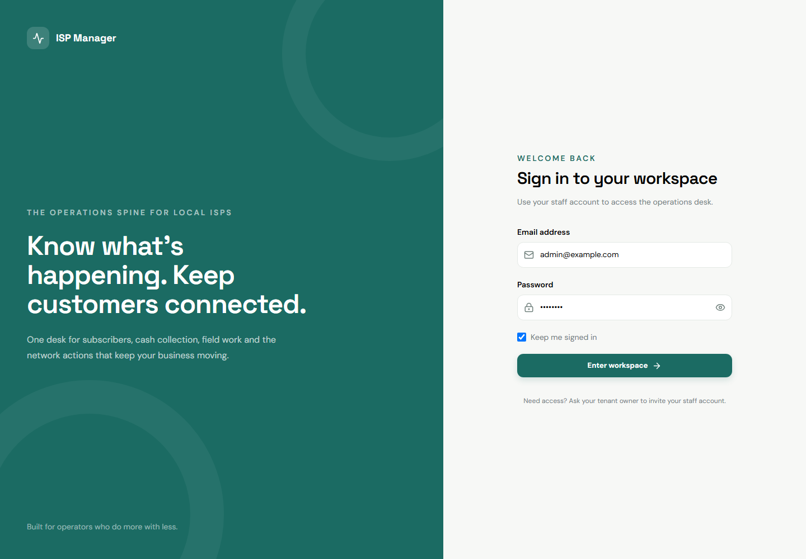

# Operator acceptance walkthrough

Use this walkthrough with the seeded demo tenant before a pilot. It is intentionally written as an observable sequence: record the public IDs returned by each step and confirm the state in the next screen or API response.

## 1. Register

1. Run `php artisan migrate --seed` in a disposable local environment.
2. Open `/login` and sign in with the seeded demo account from the README.



3. Open `/customers/create`, create a customer, and confirm the customer appears in `/customers` with a tenant-local public ID.
4. Create or import the customer service and record its public ID. A new installation should remain pending until its work order is completed.

## 2. Install

1. Use a technician token with `staff:technician` and open `GET /api/v1/technician/work-orders?status=assigned`.
2. Read the assigned work order and diagnostics, upload one piece of evidence, then complete it with a stable `X-Idempotency-Key`.
3. Confirm the response reports the service transition and queued network action. A commercial `active` status is not proof that a real router has applied the command.

## 3. Suspend

1. Use an operator token and call `POST /api/v1/services/{service}/suspend` with a unique idempotency key.
2. Confirm the service becomes commercially suspended, its network state is pending or drifted, and a network command/outbox record exists.
3. Confirm the customer timeline and audit event identify the actor and reason.

## 4. Collect

1. Open the customer record and select an issued invoice, or use `POST /api/v1/payments` with the customer and invoice public IDs.
2. Send the amount in integer minor units and reuse the same `X-Idempotency-Key` if the request times out.
3. Confirm the payment allocation, receipt message, journal balance, and customer projection. The payment must remain recorded even when a router is unavailable.

## 5. Reactivate

1. For an `auto_overdue` suspension, record the renewal payment and confirm the service returns to active with a queued activation command.
2. For a manual, fraud, or terminated state, use the explicit operator reactivation workflow and record the approval reason.
3. Run the final checks:

   ```powershell
   php artisan ledger:check-invariants
   php artisan platform:heartbeat
   php artisan queue:work --stop-when-empty --max-jobs=100 --tries=1
   ```

4. Verify `/api/v1/health` reports `status: ok`, then retain the public IDs, command results, and invariant output with the handover record.

## Sign-off boundary

This repository walkthrough and sign-in screenshot verify the documentation artifact and local application path. A pilot owner must still perform the sequence against the approved tenant, real router/lab target, notification/payment configuration, and supervised workers before signing off production readiness.
