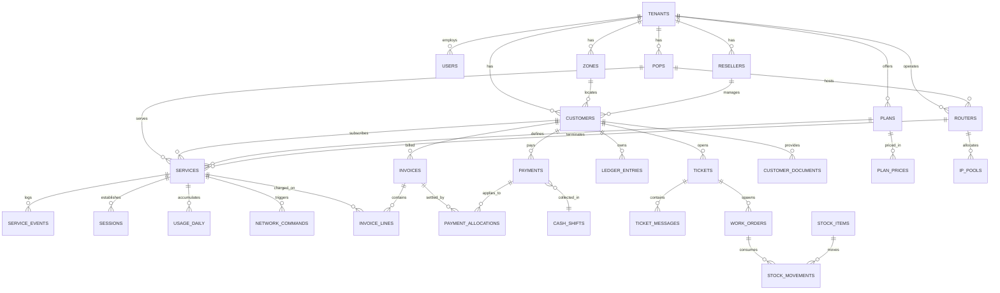

# 02 — Domain Model

Authoritative schema. Migrations must match this. If you change the schema, change this file in the same commit. **Datastore: PostgreSQL 17.**

## Conventions

- Primary keys: internal `id` — `bigIncrements` for join locality. Every table exposed in public URLs or the API also carries a **`public_id` = UUIDv7/ULID** (indexed, unique), time-ordered, used in all routes and API responses. **Never expose sequential IDs in the API or in URLs** — they let anyone enumerate the subscriber base. (Where a table below lists a `uuid` column, read it as this `public_id`; the name was normalised to `public_id` in the merge.)
- Foreign keys: `<singular>_id`, always with an explicit FK constraint and an index. Financial/network links use `ON DELETE RESTRICT`; owned children may `CASCADE`.
- Timestamps: `created_at`, `updated_at` on everything. `deleted_at` where soft deletes apply (noted per table). Store UTC; render in the tenant/user timezone.
- Money: `*_amount` = `bigInteger` minor units, always paired with `*_currency` = `char(3)` ISO-4217. Never `decimal`, never `float`. Use the currency's minor-unit scale (0/2/3-decimal currencies exist) — never hardcode `* 100`.
- Exchange rates: `decimal(20,10)`; snapshot rate + source + effective date on every conversion.
- Bytes: `bigInteger` (unsigned). Rates: `integer` kbps.
- Enums: PHP backed enums cast on the model; stored as `varchar(32)`, not a native PG enum type, so adding a case is not a migration on a large table.
- Optimistic concurrency: mutable rows where stale edits matter carry a `version` integer (bumped on write; APIs use `If-Match`/ETag).
- Tenant scoping: every table below marked **[T]** carries `tenant_id` (FK to `tenants`, indexed, non-nullable) and uses the `BelongsToTenant` trait **and** is authorized by a policy. The global scope is defense-in-depth, not the only line (`03 §4`).
- JSON columns: use `jsonb` with a cast to a typed DTO. Do **not** put core searchable fields in unrestricted JSON — use typed columns or the `custom_field_*` tables (`§2`). Document the shape in a comment on the migration.
- Composite unique constraints and tenant list indexes **begin with `tenant_id`**. Use partial unique indexes for "one active X" rules (PostgreSQL `WHERE` clauses).

---

## 1. ERD (core)



---

## 2. Tenancy & settings

### `tenants`
| Column | Type | Notes |
|---|---|---|
| id | bigint PK | |
| uuid | uuid unique | |
| name | string 120 | |
| slug | string 64 unique | used for subdomain / login hint |
| status | string 32 | `active`, `trial`, `suspended`, `cancelled` |
| base_currency | char(3) | reporting currency |
| timezone | string 64 | IANA, e.g. `Asia/Beirut` |
| locale | string 8 | default UI locale |
| logo_path | string nullable | |
| contact_phone / contact_email / address | string nullable | on invoices |
| tax_number | string nullable | |
| settings | json | see shape below |
| trial_ends_at, created_at, updated_at, deleted_at | | soft deletes |

`settings` shape (typed DTO `TenantSettings`):
```json
{
  "billing": {
    "model": "prepaid|postpaid",
    "cycle_anchor": "anniversary|calendar",
    "default_grace_days": 3,
    "grace_extends_period": false,
    "suspend_run_hour": 0,
    "invoice_prefix": "INV",
    "invoice_number_format": "{prefix}-{year}-{seq:6}",
    "tax_rate_bp": 1100,
    "tax_inclusive": false
  },
  "network": { "default_driver": "mikrotik_api|radius", "sync_interval_minutes": 5, "reconcile_hour": 3 },
  "notifications": { "channels": ["whatsapp","sms","email","push"], "expiry_reminder_days": [5,2,0] },
  "locales": ["en","ar","fr"],
  "features": { "resellers": true, "inventory": true, "work_orders": true, "portal": true }
}
```

### `branches` **[T]**
`id, tenant_id, name, code, address, phone, is_default, timestamps` — physical offices; payments and shifts belong to a branch.

### `zones` **[T]**
`id, tenant_id, name, code, parent_id (nullable self-FK), pop_id (nullable), boundary (json nullable — GeoJSON polygon), notes, timestamps`
Geographic/logical grouping used for collector assignment, outage broadcast, and reporting.

### `currencies` (global, not tenant-scoped)
`code char(3) PK, name, symbol, minor_unit tinyint, is_active`

### `exchange_rates` **[T]**
| Column | Type | Notes |
|---|---|---|
| id, tenant_id | | |
| base_currency | char(3) | tenant base |
| quote_currency | char(3) | |
| rate | decimal(20,10) | 1 base = `rate` quote |
| source | string 32 | `manual`, `api:<name>` |
| effective_from | datetime | indexed |
| created_by_id | FK users nullable | |

Unique on `(tenant_id, base_currency, quote_currency, effective_from)`. Lookup is "latest row with `effective_from <= :at`". Never delete rows — history is needed to explain old receipts.

### `document_sequences` **[T]**
`id, tenant_id, branch_id (nullable — for per-branch receipt numbering), key (string: 'invoice','receipt','credit_note','customer_code','service_no','ticket_no','work_order_no'), period (string: '2026'), prefix, next_value bigint, updated_at`
Unique on `(tenant_id, branch_id, key, period)`. Incremented with `SELECT ... FOR UPDATE` inside the issuing transaction. Gaplessness is only *promised* where legally required (`00 §7 Q8`); otherwise a rolled-back allocation may leave a hole.

### `custom_field_definitions` **[T]** — typed, tenant-scoped extension fields (do not overload JSON for searchable data)
`id, tenant_id, entity_type (customer|service|...), key, label, data_type (string|int|decimal|bool|date|enum), options json nullable, validation json, searchable boolean, visibility (staff|customer|internal), sort_order, is_active`

### `custom_field_values` **[T]**
`id, tenant_id, definition_id, entity_type, entity_id, value_string, value_int, value_decimal, value_bool, value_date` — one populated typed column per row; unique `(definition_id, entity_type, entity_id)`. Index `searchable` fields.

---

## 3. Identity & access

### `users` **[T, tenant_id nullable for super admins]**
`id, uuid, tenant_id nullable, branch_id nullable, name, email unique, phone nullable, password, avatar_path, locale, timezone, status (active|disabled), last_login_at, last_login_ip, two_factor_secret (encrypted, nullable), two_factor_recovery_codes (encrypted, nullable), two_factor_confirmed_at, remember_token, timestamps, deleted_at`

Roles via `spatie/laravel-permission` with `team_id` = `tenant_id` (enable teams mode). Baseline roles: `super_admin`, `owner`, `manager`, `operator`, `accountant`, `collector`, `technician`, `noc`, `reseller`.

Permission naming: `<module>.<action>` — e.g. `customers.create`, `payments.void`, `network.disconnect_session`, `reports.financial.view`. Enumerate the full list in a seeder; do not invent permission strings at call sites.

### `user_zone` **[pivot]**
`user_id, zone_id` — restricts collectors/technicians to their zones.

### `activity_log` — from `spatie/laravel-activitylog`, plus a `tenant_id` column added by migration and indexed.

---

## 4. Subscribers

### `customers` **[T]**
| Column | Type | Notes |
|---|---|---|
| id, uuid, tenant_id | | |
| code | string 32 | unique per tenant, from `document_sequences` |
| type | string 16 | `residential`, `business` |
| first_name, last_name | string | |
| company_name | string nullable | for business |
| phone | string 32 | normalised E.164, **unique per tenant**, indexed |
| phone_normalized | string 32 | digits only, indexed — powers partial search |
| phone_alt, whatsapp | string nullable | |
| email | string nullable | |
| national_id | string nullable, encrypted | |
| zone_id | FK zones | indexed |
| reseller_id | FK resellers nullable | |
| address_line, building, floor, apartment, landmark | string nullable | |
| latitude, longitude | decimal(10,7) nullable | |
| balance_amount | bigint default 0 | **derived cache** of the ledger; negative = customer owes |
| balance_currency | char(3) | = tenant base currency |
| status | string 32 | `lead`, `active`, `inactive`, `blacklisted`, `archived` |
| preferred_locale | string 8 | |
| referred_by_customer_id | FK self nullable | |
| notes | text nullable | |
| pii_anonymized_at | datetime nullable | |
| created_by_id | FK users | |
| timestamps, deleted_at | | |

Indexes: `(tenant_id, phone_normalized)`, `(tenant_id, code)`, `(tenant_id, zone_id, status)`, fulltext on `(first_name, last_name, company_name)`.

**Invariant:** `balance_amount` is a cache. It is recomputed from `ledger_entries` inside the same transaction that writes an entry, and a nightly job asserts cache == sum(ledger). A mismatch is a P1 alert, not a silent fix.

### `customer_contacts` **[T]** — `id, customer_id, name, relation, phone, is_primary, notes`

### `customer_documents` **[T]** — media via `spatie/laravel-medialibrary`: ID scans, signed contracts, site photos. Store `type`, `expires_at` (for ID expiry), `verified_at`, `verified_by_id`.

---

## 5. Catalog

### `plans` **[T]**
| Column | Type | Notes |
|---|---|---|
| id, uuid, tenant_id | | |
| name, code | string | code unique per tenant |
| description | text nullable | |
| service_type | string 16 | `pppoe`, `hotspot`, `static`, `dhcp` |
| download_kbps, upload_kbps | integer | |
| burst_config | json nullable | `{limit_kbps, threshold_kbps, time_s, priority}` — MikroTik burst |
| quota_bytes | bigint nullable | null = unlimited |
| quota_period | string 16 | `billing_cycle`, `daily`, `monthly` |
| fup_action | string 16 | `throttle`, `block`, `notify_only`, `none` |
| fup_download_kbps, fup_upload_kbps | integer nullable | when `throttle` |
| billing_period | string 16 | `monthly`, `weekly`, `custom_days` |
| billing_period_days | smallint nullable | when `custom_days` |
| grace_days | smallint | overrides tenant default |
| setup_fee_amount / _currency | | nullable |
| is_public | boolean | visible to resellers/portal |
| is_active | boolean | |
| sort_order | integer | |
| timestamps, deleted_at | | |

### `plan_prices` **[T]**
`id, plan_id, currency char(3), amount bigint, reseller_amount bigint nullable, effective_from datetime, timestamps`
Unique on `(plan_id, currency, effective_from)`. Retail vs reseller price in one row; commission = retail − reseller.

### `addons` **[T]** — one-off or recurring extras (static IP, extra quota bucket, equipment rental). Same price shape.
`id, tenant_id, name, code, type (one_time|recurring), amount/currency, recurring_period, is_active`

### `promotions` **[T]** — `id, tenant_id, name, code, type (percent|fixed|free_days), value, applies_to (plan_ids json nullable), starts_at, ends_at, max_redemptions, redemptions_count, is_active`

---

## 6. Network topology

### `pops` **[T]** (points of presence / towers / distribution points)
`id, uuid, tenant_id, name, code, type (tower|building|cabinet|datacenter), address, latitude, longitude, zone_id nullable, upstream_capacity_mbps nullable, status (active|maintenance|down|decommissioned), notes, timestamps`

### `routers` **[T]** (NAS devices)
| Column | Type | Notes |
|---|---|---|
| id, uuid, tenant_id | | |
| pop_id | FK nullable | |
| name, identity | string | |
| driver | string 32 | `mikrotik_api`, `mikrotik_radius`, `generic_radius` |
| host | string 64 | IP or hostname |
| api_port | smallint | default 443 for REST, 8728/8729 for legacy API |
| api_scheme | string 8 | `https` (default), `http` (dev only) |
| username | string, encrypted | |
| password | string, encrypted | |
| verify_tls | boolean default true | |
| radius_secret | string, encrypted, nullable | |
| coa_port | smallint default 1700 | **MikroTik listens on 1700, not the RFC-default 3799** |
| nas_identifier | string nullable | matches RADIUS `NAS-Identifier` |
| default_ppp_profile, blocked_ppp_profile | string nullable | direct-API mode |
| blocked_address_list | string nullable | e.g. `blocked` |
| os_version, uptime_seconds, last_seen_at | | populated by health checks |
| status | string 32 | `online`, `offline`, `degraded`, `unknown`, `disabled` |
| max_subscribers | integer nullable | capacity planning |
| timestamps, deleted_at | | |

**Invariant:** `username`, `password`, `radius_secret` use the `encrypted` cast, are in `$hidden`, and are never included in an Inertia prop or API resource.

### `ip_pools` **[T]**
`id, tenant_id, router_id nullable, name, cidr, gateway, type (dynamic|static|blocked), version (4|6), is_active, timestamps`

### `ip_addresses` **[T]**
`id, tenant_id, ip_pool_id, address (varbinary 16 + string display), status (free|assigned|reserved|conflict), service_id nullable, assigned_at`
Unique on `(ip_pool_id, address)`.

### `upstream_links` **[T]** — bandwidth cost tracking (feeds margin reports)
`id, tenant_id, pop_id, provider_name, capacity_mbps, monthly_cost_amount/currency, contract_start, contract_end, notes`

---

## 7. Services (the subscription)

### `services` **[T]** — the single most important table
| Column | Type | Notes |
|---|---|---|
| id, uuid, tenant_id | | |
| customer_id | FK | indexed |
| plan_id | FK | |
| router_id | FK nullable | |
| pop_id | FK nullable | |
| reseller_id | FK nullable | denormalised from customer for reporting |
| service_type | string 16 | copied from plan at creation; a service keeps its type |
| provisioning_mode | string 24 | `manual`, `upstream_credential`, `mikrotik`, `radius`, `external` — selects the driver (`01 §2a`, `03 §5`). The repository-side `upstream_credential` mode resolves to `CredentialDriver`, which reserves and releases tenant-scoped upstream inventory; external supplier/device acceptance remains an environment gate |
| username | string 64 | PPPoE/hotspot login, **unique per tenant** |
| password | string, encrypted | |
| mac_address | string 17 nullable | for DHCP/static binding |
| ip_address | string 45 nullable | assigned static or last seen |
| ip_address_id | FK nullable | when managed from a pool |
| vlan_id | integer nullable | |
| status | string 32 | **commercial** status: `pending`, `active`, `grace`, `suspended`, `blocked`, `paused`, `terminated` |
| suspension_reason | string 32 nullable | `auto_overdue`, `manual`, `fraud`, `quota`, `customer_request` |
| network_state | string 32 | **provisioning** status: `unknown`, `pending_sync`, `enabled`, `disabled`, `error`, `provisioning_failed` |
| desired_state_version | integer default 0 | bumped on every commercial transition; a network command carries the version it targets so a stale retry cannot reactivate a since-suspended service (`03 §5.4`) |
| network_synced_at | datetime nullable | |
| network_error | text nullable | last driver error |
| price_amount / price_currency | | override of plan price; null = use plan |
| billing_period, billing_period_days, grace_days | | snapshot from plan, overridable |
| activated_at | datetime nullable | |
| expires_at | datetime nullable | indexed — the suspension job's hot path |
| last_renewed_at | datetime nullable | |
| terminated_at | datetime nullable | |
| quota_bytes_override | bigint nullable | |
| current_period_bytes_in / _out | bigint default 0 | rolled up daily, reset per cycle |
| fup_applied_at | datetime nullable | |
| installed_by_id | FK users nullable | |
| notes | text nullable | |
| timestamps, deleted_at | | |

Indexes: `(tenant_id, status, expires_at)` ← the suspension query; `(tenant_id, username)` unique; `(tenant_id, customer_id)`; `(router_id, status)`.

### `service_events` **[T]** — append-only history
`id, tenant_id, service_id, type (created|activated|suspended|resumed|plan_changed|renewed|terminated|network_sync|fup_applied), from_status, to_status, reason, meta json, caused_by_id (user, nullable), created_at`
No `updated_at`. This table only grows.

### `network_commands` **[T]** — every intent sent to a device
| Column | Type | Notes |
|---|---|---|
| id, uuid, tenant_id | | |
| service_id | FK nullable | null for router-level commands |
| router_id | FK | |
| action | string 32 | `provision`, `enable`, `disable`, `update_rate`, `disconnect`, `deprovision`, `sync` |
| driver | string 32 | |
| payload | json | what we intended to do (credentials redacted) |
| status | string 16 | `queued`, `running`, `succeeded`, `failed`, `abandoned` |
| attempts | tinyint | |
| response | json nullable | driver response or error, redacted |
| error_message | text nullable | |
| idempotency_key | string 64 | unique per tenant |
| dispatched_at, completed_at | | |
| timestamps | | |

**Invariant:** nothing touches a router except through a `network_commands` row. This table is the audit trail, the retry queue, and the debugging surface.

**Command state machine:** `pending → claimed → executing → succeeded`, or `executing → retry_wait → executing`, or terminal `failed`/`cancelled`. Each command carries `idempotency_key` and the `desired_state_version` it targets.

### `outbox_events` **[T]** — transactional outbox for all external side effects
| Column | Type | Notes |
|---|---|---|
| id, public_id, tenant_id | | |
| aggregate_type / aggregate_id | | e.g. `service`/uuid, `payment`/uuid |
| aggregate_version | integer | the `desired_state_version` (or doc version) at emit time |
| event_type | string 64 | `service.suspended`, `payment.recorded`, `renewal.confirmed`, ... |
| payload | jsonb | redacted; no secrets |
| occurred_at | datetime | |
| published_at | datetime nullable | set when the relay dispatched it |
| failed_at, attempts | | |
Unique on `public_id`. **Written inside the same transaction as the state change**; a relay worker (or the dispatching Action's after-commit hook) publishes to the queue. External work — network commands, notifications, gateway calls, webhooks — is *never* dispatched before commit. This is what guarantees a dead router can't roll back a recorded payment (`03 §5.4`).

> **Two independent state machines per service.** `status` (commercial) and `network_state` (provisioning) move independently. A paid service can be `status=active, network_state=provisioning_failed`; the UI shows both, and a reconciliation job (`03 §5.4`) surfaces drift. A device that disagrees with the DB never changes the DB — it only raises drift and gets re-pushed our intent.

---

## 8. Sessions & usage

### RADIUS tables (stock FreeRADIUS SQL schema — do not rename)
`radcheck`, `radreply`, `radgroupcheck`, `radgroupreply`, `radusergroup`, `radacct`, `radpostauth`, `nas`.

Add a nullable `tenant_id` and `service_id` to `radacct` and `radcheck` via migration for scoping and joins, but keep all stock column names so FreeRADIUS's stock queries work unmodified.

`radacct` grows fast. At >10k subscribers: partition by `acctstarttime` monthly (or move to its own database) and archive partitions older than 12 months.

### `sessions_current` **[T]** — a small, fast, denormalised "who is online now" table
`id, tenant_id, service_id, router_id, acct_session_id, framed_ip, mac, started_at, last_update_at, bytes_in, bytes_out, current_rate_in_kbps, current_rate_out_kbps`
Upserted from RADIUS interim-updates or from router polling. Truncated/reconciled on a schedule. Do **not** query `radacct` for the live view.

### `usage_daily` **[T]** — the reporting and quota source of truth
`id, tenant_id, service_id, date (date), bytes_in, bytes_out, session_count, peak_rate_in_kbps, peak_rate_out_kbps`
Unique on `(service_id, date)`. Built by a nightly rollup job from `radacct` (or polled counters). Partition or index on `(tenant_id, date)`.

### `device_metrics` **[T]** — router/POP health samples
`id, tenant_id, router_id, sampled_at, cpu_load, memory_free_bytes, uptime_seconds, ping_ms, active_sessions, tx_bps, rx_bps`
Retention: raw 7 days, hourly aggregate 90 days, daily aggregate 2 years. Write a pruning job in Phase 8.

### `incidents` **[T]**
`id, uuid, tenant_id, pop_id nullable, router_id nullable, zone_ids json nullable, title, description, severity (info|minor|major|critical), status (open|investigating|resolved), started_at, resolved_at, notify_customers boolean, notified_at, created_by_id`

---

## 9. Billing

The financial source of truth is a **double-entry journal**. Every balance-affecting action (invoice issue, payment, allocation, credit note, refund, wallet top-up, commission accrual, supplier cost) posts a **balanced** journal entry inside its transaction. Issued documents and posted entries are **never hard-deleted** — corrections are reversals/credit/debit notes. Per-customer and per-wallet balances are *derived caches/projections* reconciled nightly (`§15`).

### `ledger_accounts` **[T]** — chart of accounts (lightweight; this is not a full GL replacement)
`id, tenant_id, code, name, type (asset|liability|equity|revenue|expense), currency nullable (null = multi-currency control), customer_id nullable, partner_id nullable, supplier_id nullable, is_system boolean, is_active`
System accounts seeded per tenant: `accounts_receivable` (per-customer subledger via `customer_id`), `cash_on_hand` (per branch/cashier), `bank`, `service_revenue`, `setup_revenue`, `tax_payable`, `discounts`, `write_offs`, `partner_wallet` (per partner+currency), `commission_expense`, `supplier_cost`, `upstream_payable`, `customer_credit`.

### `journal_entries` **[T]** — immutable header
`id, public_id, tenant_id, entry_date (business date), source_type/source_id (morph: invoice, payment, credit_note, wallet_transaction, commission_entry, supplier_bill...), description, status (posted|reversed), reverses_entry_id (FK self nullable), idempotency_key, created_by_id, created_at` — **no `updated_at`, no `deleted_at`**. Unique `idempotency_key` per tenant.

### `journal_lines` **[T]** — immutable, balanced per entry per currency
`id, tenant_id, entry_id, account_id, debit_amount bigint, credit_amount bigint, currency char(3), fx_rate decimal(20,10), base_amount bigint (converted once, never recomputed), customer_id nullable, partner_id nullable, meta jsonb`
**Check constraint:** exactly one of `debit_amount`/`credit_amount` is non-zero. **Invariant:** for each `entry_id`, sum(debit) = sum(credit) per currency, validated inside the posting transaction. Rows are never updated/deleted; a mistake is a `reversed` entry pointing at the original.

### `ledger_entries` **[T]** — per-customer statement projection (derived from `journal_lines`)
| Column | Type | Notes |
|---|---|---|
| id, public_id, tenant_id | | |
| customer_id | FK | indexed |
| entry_id | FK journal_entries | the posting that produced this statement line |
| direction | string 8 | `debit` (customer owes more) / `credit` (customer owes less) |
| type | string 32 | `invoice`, `payment`, `credit_note`, `adjustment`, `refund`, `write_off`, `reversal`, `setup_fee`, `late_fee` |
| amount | bigint | always positive; `direction` carries the sign |
| currency | char(3) | transaction currency |
| fx_rate | decimal(20,10) | to tenant base at time of write |
| base_amount | bigint | converted once, never recomputed |
| balance_after | bigint | running balance in base currency, for statement rendering |
| occurred_at | datetime | business date, may differ from `created_at` |
| created_at | | **no `updated_at`, no `deleted_at`** |

This table exists purely so a customer statement renders in one indexed query without walking the whole journal. It is written in the same transaction as its `journal_entry`, is append-only, and must always reconcile to the `accounts_receivable` lines for that customer (`§15`). `balance_after` is written under a row lock on the customer. Corrections never edit a row — they add a `reversal`.

### `invoices` **[T]**
`id, uuid, tenant_id, customer_id, number (string, unique per tenant), status (draft|issued|partially_paid|paid|overdue|void), period_start, period_end, issue_date, due_date, currency, subtotal_amount, discount_amount, tax_amount, total_amount, paid_amount, fx_rate, base_total_amount, notes, voided_at, voided_reason, pdf_path nullable, created_by_id, timestamps`

### `invoice_lines` **[T]**
`id, invoice_id, service_id nullable, plan_id nullable, addon_id nullable, description, quantity decimal(10,3), unit_amount bigint, discount_amount, tax_rate_bp, tax_amount, total_amount, period_start nullable, period_end nullable, meta json, sort_order`

### `payments` **[T]**
| Column | Type | Notes |
|---|---|---|
| id, uuid, tenant_id | | |
| customer_id | FK | |
| receipt_number | string unique per tenant | from `document_sequences` |
| amount | bigint | received amount |
| currency | char(3) | received currency |
| fx_rate | decimal(20,10) | |
| base_amount | bigint | |
| fx_rate_overridden | boolean | + `fx_override_reason` string nullable |
| method | string 32 | `cash`, `bank_transfer`, `card`, `wallet`, `mobile_money`, `gateway`, `cheque`, `credit` |
| gateway | string 32 nullable | + `gateway_reference`, `gateway_payload` json |
| reference | string nullable | cheque no, transfer ref |
| status | string 16 | `pending`, `completed`, `failed`, `reversed` |
| received_by_id | FK users nullable | collector |
| branch_id, cash_shift_id | FK nullable | |
| reseller_id | FK nullable | when paid through a sub-reseller |
| received_at | datetime | business time, may be backdated by an operator with permission |
| idempotency_key | string 64 | **unique per tenant**, from the client |
| device_recorded_at | datetime nullable | when created offline on a device |
| note | text nullable | |
| reversed_by_payment_id | FK self nullable | |
| timestamps | | no soft delete — payments are never deleted |

### `payment_allocations` **[T]**
`id, payment_id, invoice_id nullable, service_id nullable, amount, currency, created_at`
A payment can settle several invoices or be applied directly to a service renewal (prepaid model, no invoice). Sum of allocations ≤ payment amount; remainder is customer credit.

### `credit_notes` **[T]** — `id, public_id, tenant_id, customer_id, number, invoice_id nullable, amount, currency, reason, status, issued_at, created_by_id`. Reversing an issued invoice uses a credit note (or controlled void-and-reissue), never an edit.

### `refunds` **[T]** — a refund is distinct from a payment void
`id, public_id, tenant_id, payment_id, amount, currency, reason, status (pending|approved|completed), external_return_status (string: whether money was actually returned outside the system), approved_by_id, created_by_id, created_at`. A void reverses an unallocated/erroneous payment; a refund returns money already taken and must state whether the cash actually left.

### `renewal_previews` **[T]** — signed, short-lived quote consumed by the confirm step
`id, public_id, tenant_id, service_id, input_hash, snapshot jsonb (period, price, discount, credit applied, tax, customer payment, reseller buy cost, new expiry, provisioning action), expires_at, consumed_at, created_by_id`. The renewal confirm supplies the preview id + an idempotency key; the server re-verifies the snapshot before posting. Prevents "the number changed between preview and pay".

### `cash_shifts` **[T]** — collector reconciliation
`id, uuid, tenant_id, user_id, branch_id, opened_at, closed_at nullable, opening_float_amount/currency, declared_totals json (per currency), system_totals json, variance json, status (open|closed|reconciled|disputed), reconciled_by_id, notes`

### `taxes` **[T]** — `id, tenant_id, name, rate_bp (basis points), is_default, applies_to json`

---

## 10. Partners / resellers (sub-agents)

Partners (resellers) form an **adjacency-list hierarchy** with a cached path/depth for fast descendant queries. The tables below cover the core; the full price-book, wallet-funding, commission, and settlement schema — and the entire supplier / upstream-credential inventory — live in **`08-suppliers-credentials-wallets.md`**. Wallet balances are **journal-derived caches** (`§9`), not free-standing counters.

### `partners` (resellers) **[T]**
`id, public_id, tenant_id, parent_id (FK self nullable), path (materialized path, e.g. `/1/7/`), depth smallint, user_id (FK users — their login), name, code, phone, zone_ids jsonb nullable, billing_mode (prepaid_wallet|postpaid_settlement|hybrid), commission_type (margin|percent|fixed), commission_value, credit_limit_amount, low_balance_threshold_amount, currency, status (active|suspended), settings jsonb, timestamps, deleted_at`
Descendant lookups use a tested hierarchy service over `path`/`depth`, never arbitrary IDs. A child never sees a parent's cost/margin or a sibling's data.

### `partner_wallets` **[T]**
`id, tenant_id, partner_id, currency, balance_amount (cached), version, updated_at` — unique `(partner_id, currency)`. `balance_amount` must always equal the sum of the partner's `partner_wallet` journal lines for that currency (`§15`).

### `wallet_transactions` **[T]** — append-only; every row references a posted `journal_entry`
`id, public_id, tenant_id, partner_id, wallet_id, entry_id (FK journal_entries), direction, type (topup|renewal_charge|activation_charge|commission|adjustment|payout|reversal|settlement), amount, currency, balance_after, source_type/source_id, description, created_by_id, created_at`. Renewal from a wallet locks the wallet row, checks funds/credit atomically, debits the buy price, and credits revenue/margin accounts in one entry.

**v1 scope:** the tables above plus simple commission = retail − `plan_prices.reseller_amount` (`§5`). Deferred to **P1** (`08`, tickets ISP-P1-01/02): `commission_rules`, `commission_entries`, `settlements`, `price_books`, `price_book_items`, and the entire supplier/upstream-credential schema.

---

## 11. Operations

### `tickets` **[T]**
`id, uuid, tenant_id, number, customer_id nullable, service_id nullable, category (no_service|slow|intermittent|billing|relocation|equipment|other), subject, description, priority (low|normal|high|urgent), status (open|in_progress|waiting_customer|resolved|closed|reopened), source (phone|portal|whatsapp|walkin|auto), assigned_to_id, incident_id nullable, sla_due_at, first_response_at, resolved_at, resolution_code, satisfaction_rating, timestamps`

### `ticket_messages` **[T]**
`id, ticket_id, author_type (staff|customer|system), author_id nullable, body, is_internal boolean, attachments via media, created_at`

### `work_orders` **[T]**
`id, uuid, tenant_id, number, type (installation|repair|relocation|upgrade|disconnection|survey|recovery), customer_id, service_id nullable, ticket_id nullable, status (scheduled|assigned|en_route|in_progress|completed|cancelled|failed), scheduled_start, scheduled_end, assigned_to_id, started_at, completed_at, checklist json, readings json, signature_path nullable, completion_notes, failure_reason, created_by_id, timestamps`

`readings` shape (typed, per service type): wireless → `{signal_dbm, ccq, tx_rate, rx_rate, distance_m, ap_name}`; fiber → `{optical_rx_dbm, optical_tx_dbm, ont_serial, splitter_port}`.

### Inventory
- `warehouses` **[T]** — `id, tenant_id, name, branch_id nullable, type (main|van|pop), custodian_user_id nullable`
- `item_types` **[T]** — `id, tenant_id, name, category (router|onu|antenna|cable|connector|power|other), is_serialized boolean, unit (piece|meter), default_cost_amount/currency, reorder_level`
- `stock_items` **[T]** — serialised units: `id, uuid, tenant_id, item_type_id, serial, mac, warehouse_id nullable, service_id nullable, status (in_stock|assigned|faulty|in_repair|returned|lost|retired), purchase_cost_amount/currency, purchased_at, warranty_until, assigned_at, notes`
- `stock_balances` **[T]** — bulk quantities: `id, tenant_id, item_type_id, warehouse_id, quantity decimal(12,3)` unique `(item_type_id, warehouse_id)`
- `stock_movements` **[T]** — append-only: `id, tenant_id, item_type_id, stock_item_id nullable, from_warehouse_id, to_warehouse_id, service_id nullable, work_order_id nullable, quantity, type (purchase|transfer|assign|return|write_off|repair), unit_cost_amount/currency, performed_by_id, occurred_at, note`

---

## 12. Communications

### `message_templates` **[T]**
`id, tenant_id, key (expiry_reminder|payment_receipt|suspension_notice|welcome|ticket_reply|outage|custom), channel (whatsapp|sms|email|push), locale, subject nullable, body, variables json, provider_template_name nullable (for WhatsApp approved templates), is_active`

### `messages` **[T]** — outbound log
`id, uuid, tenant_id, customer_id nullable, user_id nullable, channel, template_key nullable, locale, to_address, body_rendered, status (queued|sent|delivered|read|failed), provider, provider_message_id, error, cost_amount/currency nullable, queued_at, sent_at, delivered_at, timestamps`

### `device_tokens` **[T]** — push
`id, tenant_id, tokenable_type/tokenable_id (user or customer), token, platform (ios|android|web), app (staff|customer), last_used_at, revoked_at`

---

## 13. Portal auth for customers

Customers authenticate on a **separate guard** (`customer`), not the staff `users` table.

Add to `customers`: `portal_password` (nullable, hashed), `portal_last_login_at`, `portal_enabled` boolean.

### `otp_codes` **[T]**
`id, tenant_id, identifier (phone), channel, code_hash, purpose (portal_login|password_reset|phone_verify), attempts tinyint, expires_at, consumed_at, ip, created_at`
Rate-limited: max 3 sends per phone per 15 minutes, max 5 verification attempts per code, codes are 6 digits with 5-minute TTL, stored hashed.

---

## 14. Cross-cutting tables

### `settings` **[T]** — key/value overrides beyond the `tenants.settings` blob, when a value needs its own audit trail.
### `jobs`, `job_batches`, `failed_jobs` — standard Laravel.
### `notifications` — standard Laravel, for in-app staff notifications.
### `imports` **[T]** — `id, tenant_id, type, file_path, status, total_rows, processed_rows, failed_rows, errors json, started_at, finished_at, created_by_id` — data migration is a first-class feature, not a script someone runs once.

---

## 15. Global invariants (write tests for each)

1. **Tenant isolation:** for every tenant-scoped model, a query executed while tenant A is active never returns tenant B's rows — including through relations, `find()` by ID, and route-model binding. Cross-tenant access returns 404, never 403 (no existence leak).
2. **Journal balance:** every `journal_entry` has sum(debit) = sum(credit) per currency; exactly one of debit/credit is non-zero on each line. Validated inside the posting transaction and re-asserted nightly.
3. **Balance integrity:** `customers.balance_amount` == sum of that customer's `accounts_receivable` journal lines (and == the customer's `ledger_entries` projection), base currency, at all times outside an open transaction. `partner_wallets.balance_amount` == sum of that wallet's journal lines. A mismatch is a P1 alert, not a silent fix.
4. **Ledger immutability:** no code path issues an `UPDATE` or `DELETE` on `journal_entries`, `journal_lines`, `ledger_entries`, or `payments`. Enforce with a model observer that throws, plus a PostgreSQL trigger in production.
5. **Invoice / receipt numbering:** concurrent creation for the same tenant never produces a duplicate. Numbers are unique; gaplessness is only promised where legally required. Test with parallel processes.
6. **Idempotency:** replaying a payment, renewal, or network command with the same `idempotency_key` returns the original result and creates no second row; the same key with a different body returns 409.
7. **Service uniqueness:** `(tenant_id, username)` is unique across services; a terminated service's username is released only after an explicit action, not automatically.
8. **Credential secrecy:** a serialisation test asserts that no API resource or Inertia prop ever contains `password`, `radius_secret`, `national_id`, or an upstream-credential plaintext.
9. **One active credential / item:** partial unique index enforces at most one active `credential_assignment` per service (unless configured shareable) and at most one active custody assignment per serialized inventory item.
10. **Expiry arithmetic:** renewing a service whose `expires_at` is in the future extends from `expires_at`; if in the past, extends from `now` (unless `grace_extends_period`). Test month-end clamping across Jan→Feb→Mar and across a leap year, in the tenant timezone.
11. **Provisioning desired-state version:** a network command carrying an older `desired_state_version` than the service's current version is refused — a stale retry cannot undo a newer suspension.
12. **Network command ordering:** two commands for the same service execute in dispatch order (queue keyed by service ID).
13. **FX snapshotting:** changing today's exchange rate does not alter `base_amount` on any historical journal line, ledger entry, payment, or invoice.
14. **Wallet non-overspend:** two concurrent wallet debits cannot take a partner below its permitted credit limit (row lock + check).
