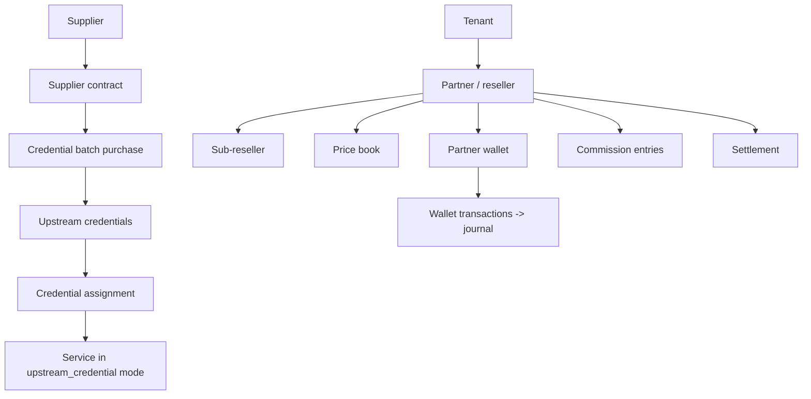
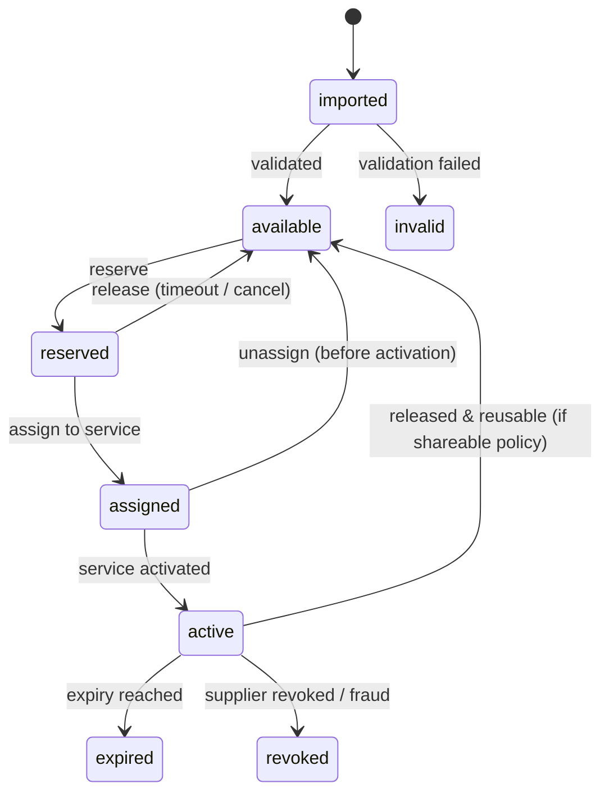

# 08 — Suppliers, Upstream Credentials, Partner Wallets & Settlement

> **Repository delivery note.** The current build includes the supplier and upstream-credential repository slice: tenant-scoped suppliers, contracts, operational bills/payments, encrypted credential inventory, linked batch imports, lifecycle-driven assignment, reconciliation and audited reveal. Advanced reseller settlement remains a separate slice, and external supplier/device acceptance is still required before production enablement.

This module covers the commercial machinery that sits **behind** a subscriber: where the bandwidth/credentials come from (suppliers), the inventory of purchased upstream accounts/vouchers, the reseller hierarchy that resells them, and the money that flows between all of them (wallets, commissions, settlement).

It is deliberately separated from core CRM/billing (`02`) because a provider can run the whole product without ever touching it — a direct provider who owns routers needs none of it. A **reseller who owns no router** lives almost entirely here: they buy upstream accounts and assign them to customers.

Everything financial in this file posts to the **double-entry journal** (`02 §9`). Wallet balances are journal-derived caches, never free-standing counters. Credentials and secrets follow the same encryption/redaction discipline as router credentials (`09`).

---

## 1. Concept map



Two independent axes meet at a renewal:

- **Supply axis** — a supplier sells the tenant upstream capacity or discrete accounts/vouchers, at a wholesale cost. That cost is allocated to the service/period it serves.
- **Reseller axis** — a partner resells a plan to a customer at a retail price, funded from a prepaid wallet or settled postpaid, earning the margin/commission.

A single renewal can debit a partner wallet (retail buy price), consume an upstream credential (supplier cost), post revenue, and accrue commission — all in one balanced journal entry.

---

## 2. Suppliers and upstream credentials

### 2.1 Domain rules

- A **supplier** is an upstream ISP or a vendor. A **supplier contract** captures terms and effective dates for a service type.
- A **credential batch** is one purchase of N upstream accounts/vouchers, with a unit and total cost in a currency. Importing a batch never logs plaintext.
- An **upstream credential** is one purchased account/voucher. It has a strict state machine and encrypted secret fields; exact-match lookups use keyed hashes, reveal returns the decrypted value under `credentials.reveal` + re-auth + audit.
- A credential is assigned to at most one active service at a time (partial unique index) unless the tenant explicitly marks the batch shareable.
- Cost is allocated to the service and billing period the credential serves, feeding margin and supplier-reconciliation reports.

### 2.2 Credential state machine



### 2.3 Schema

All tables are `[T]` (tenant-scoped). Public IDs are UUIDv7/ULID (`02` conventions).

| Table | Important fields / rules |
|---|---|
| `suppliers` | `public_id, name, type (upstream_isp\|vendor), contact fields, terms, status (active\|suspended), notes` |
| `supplier_contracts` | `supplier_id, service_type, terms jsonb, wholesale_currency, effective_from, effective_to, status` |
| `credential_batches` | `supplier_id, contract_id nullable, purchase_reference, quantity, unit_cost_amount, total_cost_amount, currency, imported_at, imported_by_id, mapper_version` |
| `upstream_credentials` | `batch_id, public_label, username_encrypted, secret_encrypted, pin_encrypted nullable, username_hash (keyed, for exact lookup), quota_bytes nullable, expires_at nullable, profile nullable, state (imported\|available\|reserved\|assigned\|active\|expired\|revoked\|invalid), version` |
| `credential_assignments` | `credential_id, service_id, reserved_at, assigned_at, released_at nullable, reason, actor_id`; **partial unique** `(credential_id) WHERE released_at IS NULL` (one active assignment) |
| `supplier_bills` | `supplier_id, reference, period_start, period_end, amount, currency, status (open\|paid), journal source`; operational payables tracking, **not** a full AP ledger |
| `supplier_payments` | `supplier_bill_id, amount, currency, paid_at, method, reference, actor_id` |

### 2.4 Secrets discipline (mandatory)

- `username_encrypted`, `secret_encrypted`, `pin_encrypted` use Laravel `encrypted` casts, are in `$hidden`, and never appear in any API resource, Inertia prop, log, or exception.
- Exact-match search is on `username_hash` (keyed HMAC), never on plaintext; never index plaintext.
- `POST /upstream-credentials/{uuid}/reveal` requires `credentials.reveal` **and** a fresh re-auth token, returns the decrypted secret once, and writes an `audit_events` row (actor, IP, credential, correlation id).
- CSV/voucher import parses in memory, encrypts before persisting, and the import log stores counts and row references — never the credential values.

### 2.5 Reconciliation report

Per period: purchased, assigned, unused/available, expiring within N days, revoked/invalid, and cost by supplier/contract. Feeds the margin report (`06 ISP-091`) and the attention queue (`05 §5a`).

---

## 3. Partners (resellers) — commercial hierarchy

The core partner tables (`partners`, `partner_wallets`, `wallet_transactions`) are defined in `02 §10`. This section adds price books, commissions, and settlement.

### 3.1 Billing modes

A partner's `billing_mode` is one of:

- `prepaid_wallet` — the partner funds a wallet; renewals debit it atomically; insufficient funds/credit block the action *before* the customer's entitlement changes.
- `postpaid_settlement` — renewals accrue to a running balance settled per period.
- `hybrid` — a wallet plus a credit limit; the wallet can go negative up to the limit.

`credit_limit_amount` and `low_balance_threshold_amount` govern blocking and low-balance alerts.

### 3.2 Price books

| Table | Important fields / rules |
|---|---|
| `price_books` | `partner_id nullable (null = tenant default), name, status, effective_from, effective_to` |
| `price_book_items` | `price_book_id, product_version_id, buy_amount_minor, sell_amount_minor, min_amount_minor, max_amount_minor, currency, commission_rule_id nullable, effective_from, effective_to` |

- A price book scopes **plan availability** (which plans a partner may sell), the **buy** price (what the partner is charged), suggested/floor/ceiling **retail**, and a commission rule.
- A renewal **snapshots** the buy/sell/min/max terms into the subscription/journal at commit; a later price-book change never rewrites posted history.
- A child reseller sees only its own buy/sell terms — never the parent's cost or margin (enforced by policy + field-level serialization).

### 3.3 Commissions

| Table | Important fields / rules |
|---|---|
| `commission_rules` | `partner_id nullable, type (margin\|percent\|fixed), value, scope (plan/zone/product optional), effective_from, effective_to, version` |
| `commission_entries` | `partner_id, source_type/source_id (the renewal/payment), rule_version, amount, currency, journal entry_id, status (accrued\|settled\|reversed), created_at`; append-only |

- Commission is computed from the **versioned** rule in force at the time of the transaction. Changing a rule creates a new version; **posted commission history is never recomputed**.
- For a `margin` rule, commission = retail − buy at the snapshotted prices.

### 3.4 Settlement

| Table | Important fields / rules |
|---|---|
| `settlements` | `partner_id, period_start, period_end, currency, opening_amount, activity_amount, closing_amount, due_amount, status (draft\|approved\|paid), approved_by_id, approved_at` |

- A settlement rolls up wallet activity + commissions for a partner/period into an opening/activity/closing/due statement.
- Approval and payout are permissioned (`settlements.approve`) and post to the journal.
- A partner statement and the tenant ledger must reconcile for the same period (`06 ISP-P1-02` AC).
- Multi-level cascading margin settlement across a deep reseller tree is explicitly **P2** — build single-level first.

---

## 4. The renewal-from-wallet transaction (worked example)

A reseller renews a customer's service, funded from a prepaid wallet, consuming an upstream credential.

In **one** database transaction:

1. Lock the service row, the partner wallet row, and the relevant `document_sequences` row.
2. Re-verify the signed `renewal_preview` (`02 §9`) — period, buy price, sell price, tax, new expiry.
3. Check wallet funds/credit: `balance + credit_limit >= buy_amount`, else abort with a clear insufficient-funds error **before** any entitlement change.
4. Post one balanced journal entry:
   - debit `partner_wallet` (buy amount), credit `service_revenue` / `commission_expense` split per the snapshotted terms;
   - if a supplier credential is consumed, debit `supplier_cost`, credit `upstream_payable` for the wholesale cost allocated to this period.
5. Write `wallet_transactions` (referencing the entry) and `commission_entries`.
6. Create the subscription period; extend `expires_at`; bump `desired_state_version`.
7. If `provisioning_mode = upstream_credential`, reserve→assign the credential (`credential_assignments`); otherwise emit the normal provisioning command.
8. Write the `outbox_events` row.
9. **Commit.** Only then does any network/notification side effect run.

Concurrency: two simultaneous renewals against the same wallet cannot overspend past the credit limit (row lock + funds check); two simultaneous assignments cannot claim the same available credential (partial unique index).

---

## 5. API surface

Endpoints are listed in `04 §6` (Partners, suppliers, credentials, wallets). Key ones:

```text
GET/POST /partners · GET /partners/{uuid}/wallets · GET /partners/{uuid}/wallet-transactions
POST /partners/{uuid}/wallet-top-ups (Idempotency-Key, approval) · GET /partners/{uuid}/settlements
GET/POST /suppliers · GET/POST /supplier-contracts · GET/POST /credential-batches
GET /upstream-credentials?filter[state]=available
POST /upstream-credentials/{uuid}/reserve · /assign · /reveal (credentials.reveal + re-auth + audit)
GET /price-books · GET /price-books/{uuid}/items
```

Offline collectors never fund wallets, adjust balances, or reveal credentials — these are online-only, permissioned actions (`04 §4`).

---

## 6. Invariants to test (extend `07 §2`)

1. A credential batch import writes zero plaintext to logs/fixtures.
2. One available credential is reserved/assigned exactly once under concurrency.
3. Reveal requires the capability + a fresh re-auth and always writes an audit event.
4. A renewal uses snapshotted buy/sell terms; a later price-book change does not alter posted rows.
5. Changing a commission rule does not recompute already-posted commissions.
6. Two concurrent wallet debits cannot overspend past the credit limit.
7. `partner_wallets.balance_amount` == sum of that wallet's journal lines.
8. A partner settlement statement reconciles to the tenant ledger for the same period.
9. A child reseller can never read a parent's cost/margin or a sibling's data (isolation suite, `07 §2 #1`).
